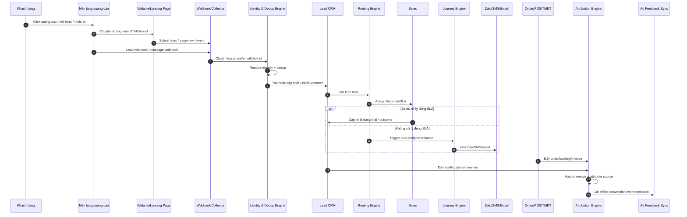
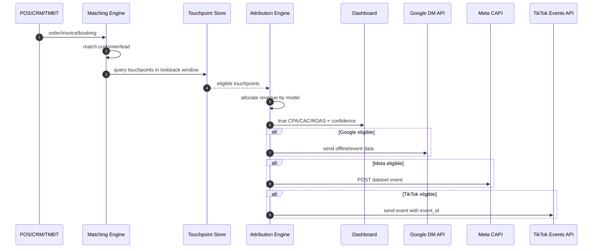
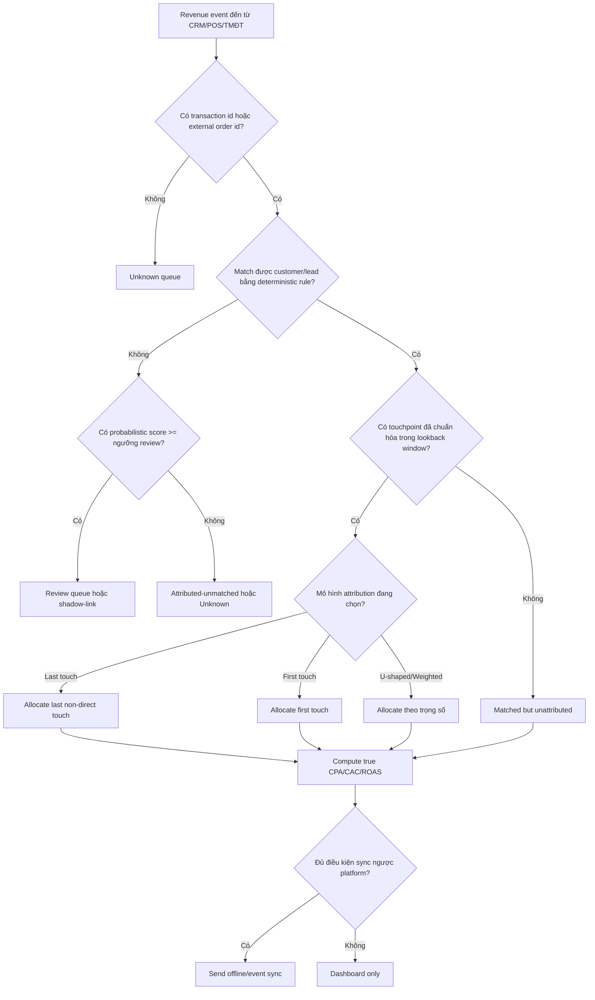

# MVP Lead-to-Revenue Automation cho thị trường Việt Nam

## Tóm tắt điều hành

Việt Nam là thị trường phù hợp để ra mắt một MVP **Lead-to-Revenue Automation** vì ba điều kiện cùng tồn tại: độ phủ số rất cao, quy mô thương mại điện tử lớn, và hành vi khách hàng phân mảnh qua nhiều điểm chạm như website, social, Zalo, sàn TMĐT và POS. DataReportal cho biết cuối năm 2025 Việt Nam có khoảng **85,6 triệu người dùng internet** với mức thâm nhập **84,2%**, khoảng **79,0 triệu định danh người dùng mạng xã hội**, và riêng **Zalo** có khoảng **78,3 triệu MAU** tại Việt Nam. Song song, VECOM cho biết **quy mô thương mại điện tử năm 2025 đạt 38,5 tỷ USD**, tăng **21%**. Điều đó khiến bài toán “lead từ quảng cáo nào ra doanh thu thật nào” không còn là nice-to-have, mà là năng lực vận hành cốt lõi. citeturn46view0turn47view0

Một MVP đúng cho Việt Nam không nên bắt đầu bằng CDP hay attribution enterprise quá rộng. Nó nên tập trung vào một vòng khép kín hẹp nhưng sinh giá trị sớm: **bắt lead đa nguồn → nhận diện khách hàng → khử trùng lặp → chấm điểm → phân cho sales theo SLA → nuôi dưỡng qua Zalo/SMS/email → ghép doanh thu/POS/TMĐT → gửi offline conversions ngược lại cho nền tảng quảng cáo**. Với cách này, sản phẩm có thể chứng minh giá trị bằng các chỉ số vận hành cụ thể như activation, time-to-value, data match rate, true CPA/CAC/ROAS, sales SLA và churn sử dụng sản phẩm, thay vì chỉ đo vanity metrics như số lead hay CPL. Thiết kế này cũng ăn khớp với thực tế tích hợp của Meta Lead Ads Webhooks, Meta Conversions API, Google Data Manager API, TikTok Events API, Zalo OA/ZNS/Webhook, cùng các API TMĐT/POS phổ biến. citeturn31search1turn31search9turn40search0turn8view4turn30search0turn29search1turn24search0turn27search5turn32search1turn10view4turn9view0

Về pháp lý, từ ngày **01/01/2026**, **Luật Bảo vệ dữ liệu cá nhân 91/2025/QH15**, **Nghị định 356/2025/NĐ-CP** và **Luật sửa đổi, bổ sung một số điều của Luật Quảng cáo 75/2025/QH15** đều có hiệu lực. Điều này tác động trực tiếp đến thiết kế consent, lưu vết xử lý dữ liệu, quyền rút lại đồng ý, lưu giữ bằng chứng, duyệt nội dung quảng cáo, và quản trị KOL/KOC/influencer. Nói cách khác, compliance không thể là “module làm sau”; nó phải là lớp nền của MVP. citeturn7search0turn7search2turn35search5

Bản báo cáo này đề xuất một MVP trong 6 tháng, ưu tiên **Meta Lead Ads + website form + Zalo OA/ZNS + import doanh thu/POS/TMĐT + Google/TikTok offline/event sync**, dùng **matching xác định là chính**, **probabilistic chỉ làm fallback có ngưỡng tin cậy**, và **rule-based lead scoring** ở giai đoạn đầu. Đây là phương án tối ưu cho tốc độ ra thị trường, kiểm soát rủi ro dữ liệu, và khả năng chứng minh ROI sớm.

## Bối cảnh Việt Nam và mục tiêu MVP

### Bối cảnh thị trường cần phản ánh trong thiết kế MVP

Bài toán ở Việt Nam không đơn thuần là “thu lead từ form”. Doanh nghiệp thường chạy lead trên Meta và TikTok, tìm kiếm trên Google, chốt đơn qua telesales hoặc CSKH, chăm sóc trên Zalo, rồi ghi nhận doanh thu ở CRM, POS hoặc sàn. Tỷ lệ sử dụng internet, mạng xã hội và Zalo rất cao, trong khi TMĐT tiếp tục tăng nhanh, nên cùng một khách có thể để lại nhiều dấu vết nhận diện trên nhiều hệ thống. Vì vậy, MVP phải được thiết kế theo tư duy **identity-first** và **revenue-first**, không phải channel-first. citeturn46view0turn47view0

| Tín hiệu thị trường | Con số đáng chú ý | Ý nghĩa cho MVP | Nguồn |
|---|---:|---|---|
| Người dùng internet tại Việt Nam | 85,6 triệu | Nền người dùng đủ lớn để ưu tiên tracking web/app và nguồn first-party | citeturn46view0 |
| Định danh mạng xã hội | 79,0 triệu | Paid social là nguồn lead lớn, cần ingest click-id và event feedback | citeturn46view0 |
| Người dùng Zalo tại Việt Nam | 78,3 triệu MAU | Zalo phải là kênh chăm sóc và xác thực journey cốt lõi, không phải add-on | citeturn46view0 |
| Quy mô TMĐT Việt Nam năm 2025 | 38,5 tỷ USD | Revenue matching phải nhìn được đơn hàng online, sàn và POS | citeturn47view0 |

### Mục tiêu kinh doanh của MVP

Mục tiêu kinh doanh của MVP nên rất rõ: **giảm thất thoát lead, rút ngắn thời gian phản hồi, đo được doanh thu thật theo nguồn quảng cáo, và tạo feedback loop ngược lại cho nền tảng ads**. Nếu MVP không làm được bốn việc này trong 60–90 ngày đầu của khách hàng, sản phẩm sẽ khó chứng minh giá trị.

Tôi đề xuất định nghĩa thành công của MVP theo ba lớp:

| Lớp mục tiêu | Mục tiêu kinh doanh | Dấu hiệu thành công |
|---|---|---|
| Vận hành | Không mất lead, không gọi trễ, không trùng lead | Lead được ingest đầy đủ, dedup ổn, routing đúng, SLA có cảnh báo |
| Đo lường | Biết lead nào thành đơn, đơn nào đến từ kênh nào | Dashboard có matched revenue và unknown bucket minh bạch |
| Tối ưu | Tăng hiệu quả marketing và sales | Có offline conversion sync, có rule auto-nudge, có dashboard quality lead |

### Bộ chỉ số thành công cho MVP

Các ngưỡng dưới đây là **đề xuất sản phẩm** cho MVP SaaS B2B; chúng không phải chuẩn pháp lý hay benchmark bắt buộc của thị trường. Chúng được xây để tối ưu **thời gian ra giá trị** trong bối cảnh Việt Nam.

| Chỉ số | Định nghĩa vận hành | Công thức đề xuất | Mục tiêu MVP đề xuất |
|---|---|---|---:|
| Activation | Tenant hoàn tất cài đặt đủ để thấy dashboard có dữ liệu | Kết nối ≥2 nguồn lead + ≥1 nguồn doanh thu + tạo ≥1 routing rule + có ≥1 dashboard chạy | ≥60% tenant mới trong 14 ngày |
| Time-to-Value | Thời gian từ tạo tenant đến khi thấy matched revenue đầu tiên | `first_matched_revenue_at - tenant_created_at` | ≤14 ngày |
| Data Match Rate | Tỷ lệ đơn/lead ghép được bằng luật xác định hoặc xác suất đủ ngưỡng | `matched_orders / all_eligible_orders` | ≥70% sau 30 ngày với dịch vụ; ≥80% khi có POS/TMĐT chuẩn hóa |
| True CPA | Chi phí để có một conversion đã xác nhận thật | `ad_cost_attributed / closed_won_count` | Phải hiển thị được theo nguồn/campaign |
| True CAC | Chi phí để có **khách hàng mới** | `attributed_cost_to_new_customers / new_customers_count` | Phải phân biệt new vs repeat |
| True ROAS | Doanh thu thật ghi nhận được trên chi phí ads | `recognized_revenue_attributed / ad_cost_attributed` | Có thêm nhãn “gross” và “net refunds” |
| Sales SLA Hit Rate | Tỷ lệ lead được xử lý trong thời hạn | `leads_touched_in_sla / assigned_leads` | ≥85% |
| Usage Churn | Khách hàng ngừng dùng sản phẩm trên thực tế | Tenant không đăng nhập/không đồng bộ dữ liệu/không update pipeline trong 30 ngày | <20% ở 90 ngày đầu |
| Logo Churn | Khách hàng hủy dịch vụ | `lost_customers / active_customers_begin_period` | <5%/tháng sau giai đoạn pilot |

### Định nghĩa chuẩn cho các chỉ số “thật”

Để tránh dashboard “đẹp nhưng sai”, MVP cần khóa ngay từ đầu các định nghĩa sau:

| Chỉ số | Định nghĩa bắt buộc |
|---|---|
| Lead | Một yêu cầu quan tâm có ít nhất một khóa nhận diện hợp lệ: phone, email, Zalo user id, leadgen_id, form submission id |
| Qualified Lead | Lead được sales hoặc rule xác nhận hợp lệ để tư vấn |
| Closed-Won | Có giao dịch/doanh thu thực hoặc hợp đồng hợp lệ |
| Revenue | Chỉ tính doanh thu đã ghi nhận trong hệ thống nguồn; hoàn/trả phải được trừ nếu có |
| New Customer | Khách chưa từng có closed-won order/hợp đồng trước thời điểm giao dịch đầu tiên |
| Attributed Revenue | Doanh thu đã ghép được order với ít nhất một touchpoint hợp lệ trong attribution window |
| Unknown Revenue | Doanh thu không đủ dữ liệu để gán nguồn một cách đáng tin cậy |

## Quy trình nghiệp vụ đầu cuối

### Luồng nghiệp vụ chuẩn của MVP

Luồng chuẩn cho MVP nên bao trùm đủ các nguồn lead phổ biến ở Việt Nam: website form, Meta Lead Ads, click-to-message, Zalo OA inbox, landing page, import thủ công/CSV, POS walk-in được capture qua số điện thoại, và đơn TMĐT nếu có. Meta cho phép lấy thông báo lead gần thời gian thực qua Lead Ads Webhooks và truy xuất chi tiết bằng `leadgen_id`; Zalo gửi sự kiện qua webhook bằng HTTP POST; Shopee hỗ trợ push mechanism cho trạng thái đơn và tracking; KiotViet cũng hỗ trợ webhook với yêu cầu phản hồi trong dưới 3 giây và mã hóa secret để xác thực. MVP nên bám vào các cơ chế “push trước, pull sau” này để giảm mất mát dữ liệu. citeturn31search1turn14search1turn30search0turn45search0turn45search12turn9view11turn10view4



### Thu lead và chuẩn hóa dữ liệu đầu vào

Những trường nên bắt buộc capture ngay từ lần chạm đầu tiên là: `source`, `medium`, `campaign`, `ad_platform`, `landing_url`, `referrer`, `gclid`, `fbclid`, `ttclid`, `leadgen_id`, `page_id`, `form_id`, `ip`, `user_agent`, `event_time`, `phone_raw`, `email_raw`, `zalo_user_id` nếu có. Với Google, offline conversion và enhanced conversions for leads dựa rất mạnh vào GCLID/GBRAID/WBRAID cùng user-provided data đã chuẩn hóa và hash; với TikTok, Events API khuyến nghị kết hợp Pixel và Events API và yêu cầu `event_id` để dedup; với Meta, Conversions API dùng `event_id` để deduplicate các bản sao event giữa browser/app và server. Do đó, collector của MVP phải coi click-id, event-id và timestamp là dữ liệu hạng nhất, không phải metadata phụ. citeturn15view4turn8view2turn18search1turn31search9turn13search3

### Identity resolution và quy tắc dedup

Đề xuất cho MVP là dùng **identity graph tối giản** với bốn nhóm khóa:

| Nhóm khóa | Ví dụ | Vai trò |
|---|---|---|
| Định danh cứng | phone chuẩn hóa, email chuẩn hóa | Khóa ghép chính |
| Định danh platform | leadgen_id, zalo_user_id, shopee buyer id nếu có | Ghép sự kiện platform về customer |
| Định danh click/session | gclid, fbclid, ttclid, session_id, event_id | Gắn touchpoint cho attribution |
| Định danh giao dịch | order_id, invoice_id, booking_id | Gắn doanh thu và chống ghi đúp |

Quy tắc dedup tối thiểu nên là:

| Thứ tự | Luật | Hành vi |
|---|---|---|
| Cao nhất | phone exact normalized | merge ngay |
| Cao | email exact normalized | merge nếu không mâu thuẫn phone |
| Cao | leadgen_id/platform lead id exact | update vào lead hiện hữu |
| Trung bình | email + tên + cùng tenant trong 30 ngày | đưa vào review queue hoặc auto-link mềm |
| Thấp | chỉ trùng tên hoặc cùng IP/device | không auto-merge, chỉ gợi ý |

Thiết kế này bám vào thực tế tài liệu của Google, Meta và TikTok: matching chính xác nhất đến từ click identifier, hashed user data, platform lead id và event dedup keys, nên dedup ở MVP phải thiên về **precision**, không chạy theo recall. citeturn8view2turn31search0turn18search1turn8view4

### Routing, SLA và follow-up journeys

Lead routing của MVP không nên quá “AI” ngay từ đầu. Nên bắt đầu bằng **rule-based routing** theo thứ tự ưu tiên: ngành hàng, chi nhánh, khu vực, ca trực, kỹ năng sales, nhiệt độ lead, tải hiện tại của sales. Phần quan trọng hơn là SLA.

Tôi đề xuất ba lớp SLA:

| Loại SLA | Đề xuất cho inbound dịch vụ | Hành động quá hạn |
|---|---|---|
| First touch | 5 phút trong giờ làm việc; 15 phút khi mở ca mới | auto-nudge sales, sau đó escalate trưởng nhóm |
| Second touch | trong 24 giờ nếu chưa liên lạc được | gửi Zalo/SMS xin khung giờ phù hợp |
| Close-loop | mọi lead phải có outcome trong 7 ngày | chuyển sang nurture hoặc recycle |

Journey nắm vai trò “chống rơi lead”, không phải thay sales. Với Việt Nam, Zalo phải là kênh ưu tiên nếu khách đã consent hoặc có bối cảnh giao dịch phù hợp, vì Zalo OA/ZNS được thiết kế để tích hợp với CRM/ERP/POS và có webhook trạng thái nhận thông báo; ngoài ra ZNS/ZBS dùng quota/ngày theo OA, nên journey engine phải có frequency cap, failover kênh và queue ưu tiên. citeturn1search7turn29search1turn29search5turn29search7

### Revenue matching và sync ngược về nền tảng quảng cáo

Doanh thu đầu vào của MVP có thể đến từ bốn nguồn: CRM deal, POS invoice, TMĐT order, hoặc import CSV chuẩn. Hệ thống chỉ được xem một giao dịch là “matched revenue” khi thỏa hai điều kiện: ghép được với lead/customer ở mức tin cậy đủ cao, và tìm được ít nhất một touchpoint trong attribution window.

Với Google, chiến lược nên ưu tiên **Data Manager API** cho build mới, vì Google nêu rõ từ **15/06/2026** việc dùng `UploadClickConversion` sẽ bị hạn chế với các developer token không nằm trong diện allowlisted cho offline conversion history; Data Manager API cung cấp endpoint REST `POST https://datamanager.googleapis.com/v1/events:ingest`, nhận event data online/offline và yêu cầu OAuth scope `https://www.googleapis.com/auth/datamanager`. Với Meta, sync ngược nên dùng Conversions API qua dataset events endpoint. Với TikTok, sync ngược dùng Events API, đồng thời duy trì `event_id` để dedup nếu website cũng đang bắn Pixel. citeturn8view2turn40search0turn17search1turn31search9turn18search1turn8view4



## Mô hình dữ liệu và yêu cầu tích hợp

### Mô hình dữ liệu tối thiểu cho MVP

MVP không cần data warehouse quá phức tạp, nhưng phải có **canonical event model** và **customer identity model**. Bộ entity tối thiểu nên gồm:

| Entity | Vai trò |
|---|---|
| `lead` | Bản ghi cơ hội đầu vào |
| `customer` | Hồ sơ hợp nhất xuyên kênh |
| `identity_link` | Liên kết phone/email/platform id/session id |
| `campaign` | Metadata chiến dịch |
| `ad_click` | Touchpoint click / form open / submit |
| `message_event` | Zalo/SMS/email gửi/nhận/đọc/click |
| `order` | Giao dịch doanh thu |
| `order_item` | SKU trong giao dịch |
| `sku` | Danh mục sản phẩm và margin basis |
| `consent` | Đồng ý/rút đồng ý/quyền tương tác |
| `task` | Việc phải làm cho sales/CS |
| `audit_log` | Nhật ký duyệt/sửa/xuất/xóa |
| `attribution_result` | Kết quả gán doanh thu theo mô hình |
| `sync_job` | Trạng thái đồng bộ vào/ra nền tảng |

### Sample schema gợi ý

Các schema dưới đây là **đề xuất kỹ thuật cho MVP**; chúng không sao chép nguyên văn từ bất kỳ vendor API nào.

```sql
CREATE TABLE lead (
  lead_id                UUID PRIMARY KEY,
  tenant_id              UUID NOT NULL,
  customer_id            UUID NULL,
  source                 TEXT NOT NULL,
  medium                 TEXT NULL,
  campaign_id            UUID NULL,
  external_lead_id       TEXT NULL,   -- Meta leadgen_id, Zalo form id...
  phone_e164             TEXT NULL,
  email_norm             TEXT NULL,
  full_name              TEXT NULL,
  zalo_user_id           TEXT NULL,
  gclid                  TEXT NULL,
  fbclid                 TEXT NULL,
  ttclid                 TEXT NULL,
  landing_url            TEXT NULL,
  lead_status            TEXT NOT NULL,
  lead_score             INT NOT NULL DEFAULT 0,
  assigned_to_user_id    UUID NULL,
  sla_due_at             TIMESTAMPTZ NULL,
  first_touch_at         TIMESTAMPTZ NULL,
  created_at             TIMESTAMPTZ NOT NULL,
  updated_at             TIMESTAMPTZ NOT NULL
);
```

```sql
CREATE TABLE customer (
  customer_id            UUID PRIMARY KEY,
  tenant_id              UUID NOT NULL,
  master_phone_e164      TEXT NULL,
  master_email_norm      TEXT NULL,
  full_name              TEXT NULL,
  first_seen_at          TIMESTAMPTZ NOT NULL,
  last_seen_at           TIMESTAMPTZ NOT NULL,
  acquisition_channel    TEXT NULL,
  is_new_customer        BOOLEAN NOT NULL DEFAULT TRUE,
  lifetime_revenue       NUMERIC(18,2) NOT NULL DEFAULT 0,
  lifetime_orders        INT NOT NULL DEFAULT 0,
  churn_risk_band        TEXT NULL
);
```

```sql
CREATE TABLE campaign (
  campaign_id            UUID PRIMARY KEY,
  tenant_id              UUID NOT NULL,
  platform               TEXT NOT NULL,   -- meta/google/tiktok/zalo
  account_id             TEXT NOT NULL,
  campaign_key           TEXT NOT NULL,   -- native id
  campaign_name          TEXT NOT NULL,
  objective              TEXT NULL,
  status                 TEXT NULL,
  started_at             TIMESTAMPTZ NULL,
  ended_at               TIMESTAMPTZ NULL
);
```

```sql
CREATE TABLE ad_click (
  click_id               UUID PRIMARY KEY,
  tenant_id              UUID NOT NULL,
  campaign_id            UUID NULL,
  platform               TEXT NOT NULL,
  click_time             TIMESTAMPTZ NOT NULL,
  gclid                  TEXT NULL,
  fbclid                 TEXT NULL,
  ttclid                 TEXT NULL,
  event_id               TEXT NULL,
  session_id             TEXT NULL,
  landing_url            TEXT NULL,
  utm_source             TEXT NULL,
  utm_medium             TEXT NULL,
  utm_campaign           TEXT NULL,
  utm_content            TEXT NULL,
  referrer               TEXT NULL,
  ip_hash                TEXT NULL,
  ua_hash                TEXT NULL
);
```

```sql
CREATE TABLE "order" (
  order_id               UUID PRIMARY KEY,
  tenant_id              UUID NOT NULL,
  customer_id            UUID NULL,
  source_system          TEXT NOT NULL,  -- crm/pos/shopee/lazada/tiktokshop/csv
  external_order_id      TEXT NOT NULL,
  order_time             TIMESTAMPTZ NOT NULL,
  order_status           TEXT NOT NULL,
  currency               TEXT NOT NULL DEFAULT 'VND',
  gross_revenue          NUMERIC(18,2) NOT NULL,
  refund_amount          NUMERIC(18,2) NOT NULL DEFAULT 0,
  net_revenue            NUMERIC(18,2) NOT NULL,
  total_cogs             NUMERIC(18,2) NULL,
  shipping_fee           NUMERIC(18,2) NULL,
  platform_fee           NUMERIC(18,2) NULL,
  voucher_cost           NUMERIC(18,2) NULL
);
```

```sql
CREATE TABLE sku (
  sku_id                  UUID PRIMARY KEY,
  tenant_id               UUID NOT NULL,
  external_sku_id         TEXT NULL,
  sku_code                TEXT NOT NULL,
  sku_name                TEXT NOT NULL,
  category                TEXT NULL,
  list_price              NUMERIC(18,2) NULL,
  standard_cogs           NUMERIC(18,2) NULL,
  active                  BOOLEAN NOT NULL DEFAULT TRUE,
  inventory_on_hand       INT NULL
);
```

```sql
CREATE TABLE consent (
  consent_id              UUID PRIMARY KEY,
  tenant_id               UUID NOT NULL,
  customer_id             UUID NULL,
  subject_key             TEXT NOT NULL,  -- phone/email/zalo_user_id hash
  channel                 TEXT NOT NULL,  -- zalo/sms/email/call/ads
  purpose                 TEXT NOT NULL,  -- marketing/transactional/analytics
  status                  TEXT NOT NULL,  -- granted/revoked/unknown
  legal_basis             TEXT NOT NULL,  -- consent/contract/etc.
  captured_at             TIMESTAMPTZ NOT NULL,
  withdrawn_at            TIMESTAMPTZ NULL,
  source                  TEXT NOT NULL,
  evidence_uri            TEXT NULL
);
```

```sql
CREATE TABLE audit_log (
  audit_id                UUID PRIMARY KEY,
  tenant_id               UUID NOT NULL,
  actor_user_id           UUID NULL,
  actor_type              TEXT NOT NULL,  -- user/system/api
  action                  TEXT NOT NULL,  -- create/update/delete/export/approve
  entity_type             TEXT NOT NULL,
  entity_id               TEXT NOT NULL,
  before_json             JSONB NULL,
  after_json              JSONB NULL,
  reason_code             TEXT NULL,
  ip_address              INET NULL,
  created_at              TIMESTAMPTZ NOT NULL
);
```

### Ví dụ JSON bản ghi mẫu

```json
{
  "lead_id": "6b0e62c5-1df0-4e24-96af-2e3020a8151d",
  "tenant_id": "b2a3b2fb-0d95-4cf9-a489-4d2f5b645d9d",
  "source": "meta_lead_ads",
  "medium": "paid_social",
  "external_lead_id": "120987654321",
  "phone_e164": "+84901234567",
  "email_norm": "lan.nguyen@example.com",
  "full_name": "Nguyễn Lan",
  "gclid": null,
  "fbclid": "fb.1.1712312312.ABCDEF",
  "ttclid": null,
  "lead_status": "new",
  "lead_score": 74,
  "assigned_to_user_id": null,
  "sla_due_at": "2026-07-01T02:15:00Z",
  "created_at": "2026-07-01T02:10:04Z"
}
```

```json
{
  "customer_id": "360a7a1e-3e34-4cc1-a4c8-4dc0f28ec6a1",
  "tenant_id": "b2a3b2fb-0d95-4cf9-a489-4d2f5b645d9d",
  "master_phone_e164": "+84901234567",
  "master_email_norm": "lan.nguyen@example.com",
  "full_name": "Nguyễn Lan",
  "first_seen_at": "2026-06-30T09:13:00Z",
  "last_seen_at": "2026-07-01T02:10:04Z",
  "acquisition_channel": "meta_paid_social",
  "is_new_customer": true,
  "lifetime_revenue": 0,
  "lifetime_orders": 0
}
```

```json
{
  "campaign_id": "abdbfbe1-a74f-4d27-89ce-f7dd17df68d2",
  "tenant_id": "b2a3b2fb-0d95-4cf9-a489-4d2f5b645d9d",
  "platform": "meta",
  "account_id": "act_123456789",
  "campaign_key": "120200000001",
  "campaign_name": "Spa Lead Form HCM Thang 7",
  "objective": "LEADS",
  "status": "ACTIVE"
}
```

```json
{
  "click_id": "410d0dce-78f4-48ba-98bb-00f127faf890",
  "tenant_id": "b2a3b2fb-0d95-4cf9-a489-4d2f5b645d9d",
  "platform": "google",
  "click_time": "2026-06-30T08:59:12Z",
  "gclid": "CjwK...abc",
  "fbclid": null,
  "ttclid": null,
  "event_id": "evt_web_20260630_001",
  "session_id": "sess_8FZ2",
  "landing_url": "https://landing.example.vn/spa?utm_source=google&utm_campaign=brand",
  "utm_source": "google",
  "utm_medium": "cpc",
  "utm_campaign": "brand_search"
}
```

```json
{
  "order_id": "f7f73b8f-0f71-4bac-ab71-6fd8344c93ef",
  "tenant_id": "b2a3b2fb-0d95-4cf9-a489-4d2f5b645d9d",
  "customer_id": "360a7a1e-3e34-4cc1-a4c8-4dc0f28ec6a1",
  "source_system": "kiotviet_pos",
  "external_order_id": "HD000245",
  "order_time": "2026-07-02T07:40:22Z",
  "order_status": "paid",
  "currency": "VND",
  "gross_revenue": 4500000,
  "refund_amount": 0,
  "net_revenue": 4500000,
  "total_cogs": 1800000,
  "shipping_fee": 0,
  "platform_fee": 0,
  "voucher_cost": 200000
}
```

```json
{
  "sku_id": "ef67412f-5fa3-4a20-b2a0-1f192eb9fb2f",
  "tenant_id": "b2a3b2fb-0d95-4cf9-a489-4d2f5b645d9d",
  "external_sku_id": "DV_TRIETLONG_6B",
  "sku_code": "DV_TRIETLONG_6B",
  "sku_name": "Gói triệt lông 6 buổi",
  "category": "service_package",
  "list_price": 4500000,
  "standard_cogs": 1800000,
  "active": true,
  "inventory_on_hand": null
}
```

```json
{
  "consent_id": "27f77d36-12b4-4e1f-b755-97a1059694c8",
  "tenant_id": "b2a3b2fb-0d95-4cf9-a489-4d2f5b645d9d",
  "customer_id": "360a7a1e-3e34-4cc1-a4c8-4dc0f28ec6a1",
  "subject_key": "sha256:+84901234567",
  "channel": "zalo",
  "purpose": "transactional",
  "status": "granted",
  "legal_basis": "contract",
  "captured_at": "2026-07-01T02:10:06Z",
  "withdrawn_at": null,
  "source": "zalo_oa_optin",
  "evidence_uri": "s3://evidence/consent/zalo/2026/07/01/lan-nguyen.json"
}
```

```json
{
  "audit_id": "4b3d33bf-2444-4e42-b8a4-f39cf9995fec",
  "tenant_id": "b2a3b2fb-0d95-4cf9-a489-4d2f5b645d9d",
  "actor_user_id": "c9272a9a-f9a5-4f87-b8af-9df3a895eca7",
  "actor_type": "user",
  "action": "approve_content",
  "entity_type": "creative_asset",
  "entity_id": "creative_8891",
  "before_json": {"status": "pending"},
  "after_json": {"status": "approved"},
  "reason_code": "legal_check_passed",
  "created_at": "2026-07-01T04:25:01Z"
}
```

### Yêu cầu tích hợp theo nền tảng

Bảng dưới đây tổng hợp các entry point, cơ chế xác thực và tín hiệu rate limiting **đã quan sát được từ tài liệu chính thức hoặc cổng tài liệu chính thức**. Với các nền tảng JS-rendered như TikTok Shop/TikTok Business, một số đường dẫn chi tiết được công bố dưới dạng tên phương thức/trang tài liệu thay vì parse được toàn bộ body tĩnh; vì vậy, phần triển khai nên để **endpoint version-configurable** trong connector. citeturn31search1turn31search9turn40search0turn8view4turn29search1turn30search2turn24search0turn27search5turn32search1turn10view4turn9view0

| Nền tảng | Endpoint / phương thức cần dùng đầu tiên | Auth | Rate limit / quota công khai | Ghi chú MVP |
|---|---|---|---|---|
| Meta Lead Ads | Webhooks for Leads; `GET https://graph.facebook.com/v25.0/<LEAD_ID>`; `GET /<page_id>/leadgen_forms` | Page/User access token | Marketing API chịu Business Use Case limits; theo dõi header `X-Business-Use-Case-Usage`, `X-App-Usage`, `X-Page-Usage` | Ưu tiên webhook realtime, pull lead detail theo `leadgen_id` để làm giàu dữ liệu. citeturn31search1turn14search1turn31search16turn41search1turn41search7turn41search8 |
| Meta Conversions API | `POST https://graph.facebook.com/{API_VERSION}/{DATASET_ID}/events?access_token={TOKEN}` | Access token có quyền phù hợp, dataset/page context | Không có một mức cố định chung trong source reviewed; dùng usage headers và backoff | Dùng cho offline events và dedup với `event_id`. citeturn31search9turn31search4turn31search2turn13search3 |
| Google Ads / Data Manager API | `POST https://datamanager.googleapis.com/v1/events:ingest`; legacy `ConversionUploadService.UploadClickConversions` | OAuth scope `https://www.googleapis.com/auth/datamanager` | Data Manager: 100.000 request/ngày và 300 request/phút mỗi project; tối đa 2.000 event/request | Với build mới cho offline conversion nên ưu tiên Data Manager API. citeturn40search0turn16search0turn17search1turn15view3turn8view2 |
| TikTok Events API | Events API cho web/app/offline; tài liệu công khai nêu rõ kết nối qua API for Business portal | Developer app / token theo TikTok API for Business | Public help docs không nêu một quota cố định áp dụng cho mọi case trong source reviewed | Luôn gửi `event_id` nếu song song Pixel + Events API. citeturn8view4turn18search1turn19search3turn21search5 |
| Zalo OA | `GET https://openapi.zalo.me/v2.0/oa/getoa`; `GET https://openapi.zalo.me/v3.0/oa/user/detail`; webhook POST về app URL | OA Access Token | Không thấy một global RPM công khai trong source reviewed | Dùng cho hồ sơ OA/user và nhận tương tác inbound. citeturn30search2turn30search8turn30search0turn30search17 |
| Zalo ZNS / ZBS | `POST https://business.openapi.zalo.me/message/template`; `GET https://business.openapi.zalo.me/message/status`; `GET https://business.openapi.zalo.me/message/quota` | OA/ZNS auth theo Zalo | Quota gửi/ngày của OA được điều chỉnh động theo chất lượng và nhu cầu gửi | MVP phải có quota-aware queue và fallback kênh. citeturn29search1turn29search5turn29search7turn28search4 |
| Shopee Open Platform | `v2.public.get_access_token`; `v2.public.refresh_access_token`; `v2.order.get_order_list`; `v2.order.get_order_detail`; push mechanism order status | Partner ID + HMAC-SHA256 sign + access token/shop_id | Tài liệu public cho thấy có lỗi `error_rate_limit`, `Too many requests`; không thấy một mức chung cố định trong source reviewed | Dùng pull order list/detail + push order status/tracking. citeturn24search0turn24search3turn24search5turn24search14turn26search0turn45search0turn45search12 |
| Lazada Open Platform | `GET /orders/get`; `GET /order/get`; `GET /order/items/get`; `GET /products/get`; token refresh | App Key/App Secret + HMAC sign + access token | Có QPS giới hạn theo API; order query policy mới áp 10 calls/30s cùng seller từ 31/10/2025; một số API nêu 10 qps/seller | Lazada cần queue riêng cho polling order để tránh chặn seller-level. citeturn27search0turn27search5turn27search9turn27search19turn27search7turn27search13turn27search18 |
| TikTok Shop | `Get Order Detail`; `Get Authorized Shops`; token APIs trong Authorization overview | `x-tts-access-token`, chữ ký request theo tài liệu TTS | Public note cho biết có thể bị 429 khi App-level QPH vượt ngưỡng; cần xác minh lại theo app/endpoint trong Partner Center | Connector nên tách biệt với TikTok Ads connector. citeturn32search1turn32search2turn32search9turn32search13turn33search0 |
| KiotViet POS | `POST https://id.kiotviet.vn/connect/token`; `GET https://public.kiotapi.com/categories` và các resource orders/customers/invoices; webhook | OAuth 2.0 client credentials + headers `Retailer` và `Authorization: Bearer` | GET giới hạn **5000 request/giờ**; webhook yêu cầu server xử lý <3 giây và trả `200` | Đây là connector POS Việt Nam nên ưu tiên ở release đầu nếu nhắm SMB/mid-market. citeturn10view4turn10view3turn9view11 |
| Haravan | `GET https://apis.haravan.com/com/orders.json`; OAuth/OIDC token flow | Bearer access token | Leaky bucket: bucket size 80, leak rate 4/sec, vượt quá trả 429 | Dễ làm connector MVP nhờ docs rõ. citeturn8view10turn9view7turn9view0 |
| Sapo | Developer portal công khai tồn tại | Tùy ứng dụng | Không đủ chi tiết endpoint/rate trong corpus reviewed | Chỉ ưu tiên nếu có deal khách hàng bắt buộc. citeturn2search3 |

### Payload mẫu và mẫu retry/fallback

Các payload dưới đây là **payload gợi ý cho connector của MVP**, được thiết kế để tương thích với các trường cốt lõi mà tài liệu chính thức công bố cho từng nền tảng. Với Google, phải chuẩn hóa và hash user data theo yêu cầu; với Meta/TikTok nên gửi `event_id` để deduplicate; với Zalo message APIs phải tách transactional và marketing templates. citeturn8view2turn18search1turn29search1

**Meta lead detail fetch**

```http
GET /v25.0/{leadgen_id}?access_token={PAGE_OR_USER_TOKEN}
Host: graph.facebook.com
```

**Meta offline / server event**

```json
{
  "data": [
    {
      "event_name": "Purchase",
      "event_time": 1782891001,
      "event_id": "ord_HD000245",
      "action_source": "physical_store",
      "user_data": {
        "ph": ["<sha256_phone>"],
        "em": ["<sha256_email>"]
      },
      "custom_data": {
        "currency": "VND",
        "value": 4500000,
        "order_id": "HD000245"
      }
    }
  ]
}
```

**Google Data Manager event ingest**

```json
{
  "destinations": [
    {
      "googleAdsDestination": {
        "customer": "customers/1234567890"
      }
    }
  ],
  "events": [
    {
      "event": {
        "eventTimestamp": "2026-07-02T07:40:22Z",
        "eventName": "PURCHASE"
      },
      "userData": {
        "userIdentifiers": [
          {"hashedEmailAddress": "<sha256_lower_trim_email>"},
          {"hashedPhoneNumber": "<sha256_e164_phone>"}
        ]
      },
      "transactionData": {
        "transactionId": "HD000245",
        "purchaseValueMicros": "4500000000000",
        "currencyCode": "VND"
      },
      "adIdentifiers": {
        "gclid": "CjwK...abc"
      }
    }
  ]
}
```

**Zalo ZNS / template message**

```json
{
  "phone": "84901234567",
  "template_id": "123456",
  "template_data": {
    "customer_name": "Nguyễn Lan",
    "booking_code": "BK20260702",
    "booking_time": "14:00 02/07/2026"
  },
  "tracking_id": "journey_booking_reminder_20260702_001"
}
```

**KiotViet token request**

```http
POST /connect/token
Host: id.kiotviet.vn
Content-Type: application/x-www-form-urlencoded

scopes=PublicApi.Access&
grant_type=client_credentials&
client_id={CLIENT_ID}&
client_secret={CLIENT_SECRET}
```

**Retry/fallback pattern đề xuất**

| Tình huống | Mẫu xử lý |
|---|---|
| 429 / rate limited | exponential backoff có jitter; respect `Retry-After` nếu có |
| Webhook failure | trả 200 sớm sau khi xác thực, đưa message vào queue async |
| Platform tạm lỗi | retry tối đa 3–5 lần; sau đó chuyển dead-letter queue |
| Token hết hạn | refresh token / rotate token trước khi retry business request |
| Thiếu dữ liệu để sync conversion | giữ trong retry queue chờ enrichment tối đa 24–72h |
| API down kéo dài | fallback sang file import CSV hoặc manual upload job |

## Logic matching, attribution và lead scoring

### Logic matching nên thiết kế như thế nào

MVP nên chọn triết lý: **deterministic first, probabilistic second, unknown always visible**. Điều này đặc biệt quan trọng ở Việt Nam vì cùng một khách có thể dùng nhiều số điện thoại, dùng nickname trên social, chốt đơn offline, hoặc để lại số qua inbox rồi mua sau tại cửa hàng.

#### Luật matching xác định

| Độ ưu tiên | Luật matching | Confidence đề xuất | Tự động hay review |
|---|---|---:|---|
| Rất cao | `order.phone_e164 == customer.master_phone_e164` | 1.00 | Auto |
| Rất cao | `order.external_customer_id == platform_customer_id` | 1.00 | Auto |
| Rất cao | `lead.external_lead_id == platform_lead_id` | 0.99 | Auto |
| Cao | `email_norm exact` + cùng tenant | 0.97 | Auto |
| Cao | `gclid` exact và order nằm trong lookback window | 0.96 | Auto |
| Cao | `event_id/order_id` exact giữa browser-server records | 0.95 | Auto |
| Trung bình | `name + phone_last7 + province` | 0.80 | Review hoặc shadow-link |
| Thấp | cùng IP/UA/session cluster | 0.55 | Không auto-merge |

Với Google, GCLID/GBRAID/WBRAID là định danh click hợp lệ cho upload conversion; với TikTok và Meta, `event_id` là khóa dedup quan trọng khi dùng song song pixel/browser và server-side ingestion. Vì vậy, các trường này phải đi xuyên suốt từ collector đến attribution engine. citeturn16search5turn15view4turn18search1turn31search9

#### Fallback xác suất

Probabilistic matching nên được dùng rất hạn chế ở MVP. Nên áp dụng chỉ trong hai trường hợp:

| Trường hợp | Cho phép? | Lý do |
|---|---|---|
| Gợi ý merge hồ sơ | Có | Hỗ trợ vận hành, ít rủi ro |
| Tự động ghi đè customer master record | Không | Rủi ro làm bẩn dữ liệu |
| Tự động gửi offline conversion ngược nền tảng | Không nếu chỉ là xác suất | Rủi ro “pollute” training data |
| Tính chỉ số nội bộ dạng shadow attribution | Có | Hữu ích để đánh giá mô hình |

### Xử lý UTM và click-id

Chuẩn gợi ý cho collector:

| Trường | Quy tắc |
|---|---|
| `utm_source`, `utm_medium`, `utm_campaign`, `utm_content`, `utm_term` | Lưu nguyên bản + phiên bản normalized |
| `gclid`, `gbraid`, `wbraid` | Không overwrite nếu đã có; gắn vào session đầu tiên |
| `fbclid`, `ttclid` | Lưu ở cả raw landing params và event record |
| `event_id` | Tạo ở server nếu client không cấp; phải deterministic theo đơn hoặc form event |
| `leadgen_id` | Lưu riêng khỏi `external_lead_id` để dễ truy vết Meta |

### Mô hình attribution cho MVP

Không nên cố làm full MMM hay full data-driven attribution từ ngày đầu. MVP nên hỗ trợ 4 mode:

| Mode | Dùng khi nào | Ưu điểm | Nhược điểm |
|---|---|---|---|
| Last touch | Báo cáo tối ưu chiến dịch ngắn hạn | Dễ hiểu, quen thuộc | Thiên vị retargeting |
| First touch | Đo acquisition channels | Hữu ích cho growth | Thiên vị upper funnel |
| U-shaped | Hành trình có touch đầu + touch chốt rõ | Cân bằng hơn | Phức tạp hơn với người dùng phổ thông |
| Weighted multi-touch | Sau khi dữ liệu đủ sạch | Linh hoạt | Tăng tranh luận và support cost |

Đề xuất cho MVP là **default = last non-direct touch**, đồng thời cho phép xem **first touch** ở dashboard đối chiếu. Multi-touch chỉ nên là tùy chọn nâng cao ở release sau.

### Revenue allocation và confidence score

| Tình huống | Revenue allocation | Confidence |
|---|---|---:|
| 1 touchpoint xác định rõ | 100% vào touchpoint đó | Cao |
| 2 touchpoint paid trong window | chia theo model đã chọn | Trung bình-cao |
| Order match được customer nhưng không có touchpoint paid | đưa vào “matched but unattributed” | Trung bình |
| Platform báo conversion nhưng không match được order/lead nội bộ | đưa vào “attributed but unmatched” | Thấp-trung bình |
| Không đủ định danh | “unknown” | Thấp |

#### Flow quyết định attribution



### Lead scoring cho MVP

Tôi khuyến nghị **rule-based scoring** cho release đầu, và chỉ đưa ML vào release sau dưới dạng **shadow model**. Lý do rất thực dụng: ở MVP, dữ liệu nhãn thường chưa đủ sạch, chưa đủ volume, và quy trình sales còn chưa ổn định; nếu vào ML quá sớm, mô hình học cả lỗi vận hành.

#### Bộ feature đề xuất

| Nhóm feature | Ví dụ |
|---|---|
| Hồ sơ lead | khu vực, dịch vụ quan tâm, ngân sách, độ tuổi nếu có |
| Nguồn và ngữ cảnh | platform, campaign, adset, creative, keyword intent |
| Hành vi số | số lần mở trang, dwell time, form depth, click CTA |
| Tương tác sales | phản hồi ở lần gọi đầu, thời gian chờ, outcome trước đó |
| Tương tác nuôi dưỡng | mở Zalo/email, click message, phản hồi chatbot |
| Lịch sử khách hàng | đã mua chưa, LTV trước đó, churn risk, số ticket CS |

#### Bảng trọng số mẫu

| Feature | Điều kiện | Điểm |
|---|---|---:|
| Nguồn lead | search brand/high-intent | +20 |
| Nguồn lead | Meta Lead Ads broad | +8 |
| Có số điện thoại hợp lệ | đúng E.164 sau chuẩn hóa | +15 |
| Có email hợp lệ | đúng định dạng và không disposable | +8 |
| Điền form đầy đủ | >80% trường bắt buộc | +10 |
| Gọi trong SLA | first touch <5 phút | +12 |
| Khách trả lời tin nhắn | có reply/click Zalo/SMS | +15 |
| Đã từng mua | repeat customer | +18 |
| Lead rơi ngoài giờ | chưa phản hồi sau 24h | -10 |
| Trùng lead cũ 30 ngày | duplicate recent | -12 |
| Dấu hiệu spam | phone/email blacklist | -40 |

#### Ngưỡng và hành động

| Điểm | Nhóm | Hành động |
|---:|---|---|
| 80–100 | Hot | assign sales senior + gọi ngay + Zalo xác nhận |
| 60–79 | Warm | assign bình thường + 2 lần follow-up trong 24h |
| 40–59 | Nurture | auto journey + nhắc sales nhẹ |
| <40 | Low / suspect | review hoặc hạ priority |

## Tự động hóa, guardrails, compliance và UX tối thiểu

### Bộ rule tự động hóa cho MVP

Rule engine của MVP nên “ít nhưng chắc”. Tôi đề xuất một bộ rule cơ bản như sau.

| Rule | Trigger | Action | Guardrail |
|---|---|---|---|
| Auto-assign lead | lead mới vào | gán sales theo khu vực/ca tải | không assign cho user off-shift |
| Auto-nudge sales | quá 5 phút chưa first touch | push/app/email nhắc sales | tối đa 3 lần/lead |
| Escalation | quá 15 phút chưa xử lý | nhắc trưởng nhóm / reassign | ghi audit log |
| Auto-nurture | lead chưa liên lạc được sau 2 lần | gửi Zalo/SMS xin lịch phù hợp | phải check consent/channel eligibility |
| Recycle lead | outcome = no answer / not ready | đưa vào queue nurture 7–30 ngày | cooldown chống spam |
| Offline sync | order paid và confidence cao | gửi event vào Google/Meta/TikTok | không sync nếu match chỉ xác suất |
| Auto-pause ads | CPA vượt ngưỡng + lead quality thấp | gắn cờ pause đề xuất | cần human approval nếu spend lớn |
| Inventory-aware hold | SKU sắp hết hàng hoặc margin âm | pause campaign/SKU mapping | chỉ áp cho campaign có SKU map rõ |

### Guardrails cho ads automation gắn với lợi nhuận/SKU/tồn kho

MVP chưa nên “toàn quyền đổi ngân sách”. Nên dùng ba tầng approval.

| Tầng | Điều kiện | Hành động tự động |
|---|---|---|
| Safe | đổi nhỏ dưới ±10%, chi dưới ngưỡng ngày, confidence cao | tự chạy |
| Review | đổi 10–25%, campaign spend đáng kể | tạo đề xuất + chờ duyệt |
| Block | data match thấp, unknown cao, margin âm, consent/compliance fail | không cho chạy |

Nếu tích hợp e-commerce/POS, rule “auto-pause theo profit/SKU/inventory” chỉ nên bật khi có đủ ba yếu tố: **SKU mapping đúng**, **margin basis đã khai báo**, **inventory sync đủ tin cậy**. Nếu thiếu một trong ba, rule chỉ nên tạo suggestion. Điều này đặc biệt đúng với dữ liệu sàn và POS nơi trạng thái đơn, hoàn đơn, voucher và giá vốn có thể cập nhật lệch nhịp. Các nền tảng TMĐT/POS công khai đều cho thấy tồn tại rate limits/QPS limits và trạng thái đơn cần đồng bộ qua API/push/webhook, nên hạ tầng rule phải vận hành trên dữ liệu có timestamp và versioning, không dựa vào “ảnh chụp tức thời”. citeturn27search13turn27search18turn45search0turn9view0turn10view4

### Compliance và consent flows

Từ 01/01/2026, luật mới về dữ liệu cá nhân và quảng cáo làm cho bốn luồng sau trở thành bắt buộc về mặt thiết kế: **capture consent**, **thực thi opt-out**, **lưu dấu vết xử lý dữ liệu**, và **duyệt nội dung/bằng chứng quảng cáo**. Luật Bảo vệ dữ liệu cá nhân 2025 có hiệu lực từ 01/01/2026; Nghị định 356/2025/NĐ-CP hướng dẫn cũng có hiệu lực cùng ngày. Chính phủ cũng nêu rõ luật quy định các trường hợp xử lý dữ liệu không cần sự đồng ý nhưng yêu cầu cơ chế giám sát, quy trình xử lý và biện pháp bảo vệ phù hợp; đồng thời, xử lý dữ liệu trái luật và mua bán dữ liệu cá nhân là hành vi bị cấm. Về quảng cáo, Luật sửa đổi 2025 có hiệu lực từ 01/01/2026 và bổ sung nghĩa vụ đối với người chuyển tải sản phẩm quảng cáo, đặc biệt trong quảng cáo trên mạng. citeturn7search0turn7search2turn35search6turn36search1turn37search0turn35search5turn38search2turn38search8

#### Luồng consent đề xuất

| Bước | Thiết kế MVP |
|---|---|
| Capture | Lưu thời điểm, kênh, mục đích, legal basis, bằng chứng, nguồn capture |
| Enforce | Mọi outbound message/query segment phải check consent trước khi send |
| Withdraw | Opt-out phải cập nhật real-time và chặn send tiếp theo |
| Retain | Thiết lập retention theo chính sách doanh nghiệp/pháp luật/ngành |
| Evidence | Mỗi consent và mỗi lần send phải truy xuất được bằng chứng |

#### Bản đồ điều khiển tuân thủ

| Yêu cầu vận hành | Điều khiển hệ thống | Cơ sở pháp lý / tài liệu |
|---|---|---|
| Không xử lý dữ liệu tùy tiện | consent table + legal basis + policy engine | Luật 91/2025/QH15; bài viết chính phủ về các trường hợp không cần đồng ý nhưng phải có cơ chế giám sát citeturn7search0turn36search1 |
| Quyền rút lại đồng ý / ngừng xử lý | opt-out endpoint + suppression list + stop future sends | Các bài viết chính phủ về rút lại đồng ý/ngừng xử lý; nguyên tắc xóa, hủy theo quy định liên quan citeturn36search6turn37search2turn37search11 |
| Cấm mua bán dữ liệu cá nhân | export guardrail + masked views + audit for exports | Chính phủ nêu cấm mua bán dữ liệu cá nhân và xử lý trái luật citeturn37search0turn36search7 |
| Quảng cáo/KOL phải truy vết được nội dung và tài liệu | content approval workflow + claim library + evidence vault | Luật Quảng cáo 75/2025/QH15 và diễn giải chính phủ về người chuyển tải quảng cáo citeturn35search5turn38search2turn38search8 |
| Thông điệp transactional qua Zalo phải có trạng thái và quota | message status sync + quota check | Tài liệu Zalo status/quota APIs citeturn29search5turn29search7 |

#### Checklist duyệt nội dung KOL/KOC

| Hạng mục | Bắt buộc trong MVP? |
|---|---|
| Có brief/hợp đồng định danh rõ brand, KOL/KOC, campaign | Có |
| Có bản nội dung/video/file final đã duyệt | Có |
| Có checklist claim rủi ro theo ngành | Có |
| Có nhãn “quảng cáo/hợp tác/tài trợ” nếu áp dụng | Có |
| Có bằng chứng nguồn gốc claim | Có |
| Có log ai duyệt và lúc nào | Có |
| Có versioning nếu sửa nội dung sau duyệt | Có |

### Màn hình UX tối thiểu

MVP nên tránh UI “all-in-one khó học”. Nên chia theo vai trò.

| Vai trò | Màn hình tối thiểu cần có |
|---|---|
| Marketing | Overview, lead source dashboard, campaign quality dashboard, offline sync monitor |
| Sales | Lead inbox, queue của tôi, detail lead, timeline hoạt động, task/SLA |
| CS / CRM Ops | Journey monitor, template manager, consent status, message log |
| Admin | User/role, connector setup, field mapping, routing rules, audit log, data retention |

#### Danh sách wireframe đề xuất

| Screen | Mục tiêu |
|---|---|
| Tenant onboarding wizard | kết nối data sources và map field |
| Lead inbox | gom lead mới, filter, batch actions |
| Lead detail 360 | xem profile, touchpoints, notes, outcome, messages |
| Routing & SLA rules | chỉnh quy tắc assign/escalate |
| Journey builder lite | template-based action chains |
| Revenue matching console | xem order match/unmatched/review |
| Attribution dashboard | true CPA/CAC/ROAS + confidence + unknown bucket |
| Consent center | xem/thu hồi/xuất bằng chứng consent |
| Audit & approvals | lịch sử duyệt nội dung, export, delete |
| Sync health view | job status, error queue, retry queue |

#### Mockup dashboard dạng ASCII

```text
+----------------------------------------------------------------------------------+
| LEAD-TO-REVENUE OVERVIEW                                                         |
+----------------------+----------------------+----------------------+--------------+
| Leads mới            | SLA hit rate         | Match rate           | Unknown rev. |
| 1,248                | 87.4%                | 76.8%                | 11.2%        |
+----------------------+----------------------+----------------------+--------------+

Nguồn lead             Leads     Qualified     Won       Net Rev.      True CPA
--------------------------------------------------------------------------------
Meta Lead Ads          520       188           41        612,000,000   1,170,000
Google Search          214       126           39        845,000,000     820,000
TikTok                 301        77           11        141,000,000   2,540,000
Zalo OA / Organic      143        56           19        203,000,000     390,000
--------------------------------------------------------------------------------

Funnel
Leads  ██████████████████████████████████ 1248
SQL    ██████████████                     447
Won    ████                               110

Revenue attribution
Known  ████████████████████████████       88.8%
Unk.   ███                                11.2%
```

## Kế hoạch triển khai sáu tháng

### Nguyên tắc triển khai

Kế hoạch 6 tháng nên theo sprint 2 tuần, tổng cộng 12 sprint. Đừng cố “launch lớn”. Cần ba mốc rõ: **internal alpha**, **design partner beta**, **public MVP**.

### Kế hoạch sprint đề xuất

| Sprint | Trọng tâm | Deliverable chính | Acceptance criteria |
|---|---|---|---|
| Sprint đầu | Product spec + architecture | PRD, data contracts, event taxonomy | chốt scope MVP, model dữ liệu, security baseline |
| Sprint tiếp theo | Tenant, auth, RBAC | multi-tenant app shell, user/role | tạo tenant, phân quyền, audit auth event |
| Sprint tiếp theo | Lead collector | website form SDK/API, CSV import | ingest lead, lưu UTM/click-id, basic validation |
| Sprint tiếp theo | CRM core | lead inbox, lead detail, status pipeline | tạo/sửa lead, comment/note, assign thủ công |
| Sprint tiếp theo | Identity & dedup | normalize phone/email, merge engine | dedup deterministic, merge audit log |
| Sprint tiếp theo | Routing + SLA | rule engine cơ bản, task/escalation | auto-assign và SLA alert chạy đúng |
| Sprint tiếp theo | Zalo/Message core | Zalo OA inbound, template log, outbound queue | nhận webhook, gửi transactional flow test |
| Sprint tiếp theo | Revenue ingest | order/POS/TMĐT CSV, KiotViet/Haravan connector đầu tiên | ingest order, tính net revenue, map customer |
| Sprint tiếp theo | Attribution engine | first/last touch, match console | có matched/unmatched/unknown dashboard |
| Sprint tiếp theo | Offline sync | Meta CAPI + Google DM API + TikTok event adapter | sync thành công test events end-to-end |
| Sprint tiếp theo | Compliance layer | consent center, approvals, audit/export guard | opt-out có hiệu lực, export có audit |
| Sprint cuối | Hardening + beta launch | monitoring, retries, docs, onboarding playbook | design partner dùng thật 2–4 tuần không blocker critical |

### Nguồn lực tối thiểu

| Vai trò | FTE đề xuất | Vai trò chính |
|---|---:|---|
| Product owner / PM | 1.0 | scope, priority, design partner management |
| Tech lead / backend | 1.0 | architecture, connectors, queues, security |
| Backend engineer | 2.0 | CRM, data model, workflow, integrations |
| Frontend engineer | 2.0 | inbox, dashboards, admin/setup, UX |
| Data / integration engineer | 1.0 | schema mapping, click-id pipeline, attribution jobs |
| QA / automation tester | 1.0 | regression, webhook/API failure, acceptance tests |
| DevOps / SRE | 0.5 | CI/CD, secrets, observability, backup |
| Product designer | 0.5 | onboarding, sales/marketing UX |
| Customer success / implementation | 1.0 | setup khách hàng, training, feedback loop |
| Legal/compliance advisor | 0.2–0.3 | consent, approvals, KOL checklist |

### Phạm vi kỹ thuật nên khóa từ đầu

| Quyết định | Chốt ngay | Để sau |
|---|---|---|
| Rule-based scoring | Có | ML production |
| Deterministic matching | Có | probabilistic auto-writeback |
| Last/first-touch | Có | data-driven attribution |
| Zalo transactional + inbound | Có | full omnichannel builder |
| Meta + Google + TikTok feedback loop | Có | advanced bid automation |
| KiotViet/Haravan + CSV order import | Có | full Sapo + ERP zoo |
| Consent + audit + approvals | Có | legal workflow theo từng ngành sâu |

## Rủi ro, KPI hậu triển khai và lộ trình ba bản phát hành

### Rủi ro chính và cách giảm thiểu

| Rủi ro | Tác động | Giảm thiểu |
|---|---|---|
| API thay đổi / deprecation | sync lỗi, mất dữ liệu, launch delay | adapter layer theo vendor; config version; contract tests; watch release notes. Google đã thay đổi mạnh hướng offline conversion sang Data Manager API. citeturn8view2turn16search15 |
| Rate limit / throttling | job fail, backlog lớn | queue tách theo connector; retry with jitter; pacing theo vendor; health dashboard. Haravan, KiotViet, Google DM, Lazada đều công bố giới hạn hoặc 429 semantics công khai. citeturn9view0turn10view4turn16search0turn27search13 |
| Dữ liệu bẩn từ sales/POS | match rate thấp, dashboard sai | canonical mapper, required fields, review queue, data quality score |
| Consent bị bỏ qua | rủi ro pháp lý và spam | policy engine chặn send; suppression list theo real time; evidence store. citeturn36search1turn37search0turn38search8 |
| Merge nhầm customer | sai attribution và sai chăm sóc | chỉ auto-merge deterministic; probabilistic chỉ review/shadow |
| Unknown revenue quá cao | mất niềm tin dashboard | buộc capture click-id, bắt phone/email chuẩn, ưu tiên webhook và POS connectors có id ổn định |
| Sales không nhập outcome | không đo được lead quality | UX một click outcome, mobile-first, SLA dashboard cho manager |
| Quá nhiều tính năng trong MVP | chậm launch | khóa phạm vi theo 3 release phía dưới |

### KPI cần theo dõi sau launch

| Nhóm KPI | KPI theo dõi |
|---|---|
| Adoption | activation rate, time-to-first-source, time-to-first-matched-revenue |
| Data health | data match rate, unknown revenue %, duplicate lead rate, consent coverage |
| Sales ops | SLA hit rate, first response time, no-answer rate, recycle rate |
| Marketing truth | true CPA, true CAC, true ROAS, lead-to-win rate theo campaign |
| Connector health | job latency, 429 rate, token refresh failures, DLQ size |
| Messaging health | delivery rate, click/reply rate, opt-out rate, quota usage |
| Product health | WAU/MAU theo role, feature usage depth, support tickets, logo churn |

### Ba bản phát hành ưu tiên

#### Release đầu tiên

Mục tiêu là **chứng minh vòng khép kín từ lead đến revenue**.

| Thành phần | Độ phức tạp | Tác động kinh doanh | Time-to-build |
|---|---:|---:|---:|
| Website form + CSV import | Thấp | Cao | Nhanh |
| CRM inbox + pipeline + SLA | Trung bình | Rất cao | Trung bình |
| Identity/dedup deterministic | Trung bình | Rất cao | Trung bình |
| Meta Lead Ads webhook + pull lead detail | Trung bình | Rất cao | Trung bình |
| Revenue import CSV + POS connector đầu tiên | Trung bình | Rất cao | Trung bình |
| Last/first-touch dashboard | Trung bình | Cao | Trung bình |
| Zalo OA inbound + transactional queue | Trung bình | Cao | Trung bình |
| Consent center + audit log nền | Trung bình | Cao | Trung bình |

**Khuyến nghị ưu tiên:** Meta Lead Ads, website forms, KiotViet hoặc Haravan, Zalo OA inbound, CSV order import.

#### Release tiếp theo

Mục tiêu là **tăng độ chính xác và đóng feedback loop ra nền tảng ads**.

| Thành phần | Độ phức tạp | Tác động | Time-to-build |
|---|---:|---:|---:|
| Google Data Manager offline/event sync | Trung bình-cao | Rất cao | Trung bình |
| Meta CAPI offline sync | Trung bình | Cao | Trung bình |
| TikTok Events API adapter | Trung bình | Cao | Trung bình |
| Match console + review queue | Trung bình | Cao | Nhanh |
| Zalo ZNS/ZBS status & quota aware sending | Trung bình | Cao | Trung bình |
| Shopee/Lazada order pull + push support | Cao | Cao | Chậm hơn |

**Khuyến nghị ưu tiên:** Google DM API, Meta CAPI, TikTok Events adapter, Zalo status/quota, order pull từ Shopee/Lazada.

#### Release sau đó

Mục tiêu là **tối ưu và mở rộng**.

| Thành phần | Độ phức tạp | Tác động | Time-to-build |
|---|---:|---:|---:|
| Profit/SKU/inventory rules | Cao | Cao | Chậm |
| Probabilistic matching shadow model | Trung bình-cao | Trung bình-cao | Trung bình |
| ML lead scoring shadow model | Cao | Trung bình | Chậm |
| Ad budget suggestion / auto-pause with approval | Cao | Cao | Trung bình-cao |
| KOL/KOC approval & evidence vault | Trung bình | Cao ở ngành nhạy cảm | Trung bình |

### Checklist ưu tiên thực thi

| Ưu tiên | Việc phải làm trước | Lý do |
|---:|---|---|
| Rất cao | Event taxonomy, canonical IDs, phone/email normalization | Không làm trước thì attribution sai từ gốc |
| Rất cao | Meta lead ingest và revenue ingest | Đây là đường ngắn nhất tới ROI thấy được |
| Rất cao | Consent + audit nền | Luật mới khiến đây là bắt buộc về thiết kế citeturn7search0turn35search5 |
| Cao | Zalo OA/ZNS integration | Phù hợp đặc thù Việt Nam và có MAU rất lớn citeturn46view0turn29search1 |
| Cao | Google DM API connector | Tránh mắc nợ kỹ thuật với luồng offline conversions cũ citeturn8view2turn40search0 |
| Trung bình | Shopee/Lazada full sync | Tác động lớn nhưng phức tạp hơn, nhiều rate limit |
| Trung bình | TikTok Shop connector | Quan trọng nếu có khách hàng social commerce nặng |
| Sau MVP | ML scoring và full automation ads | Dữ liệu chưa đủ sạch ở giai đoạn đầu |

Kết luận ngắn gọn: với thị trường Việt Nam, MVP Lead-to-Revenue Automation khả thi nhất khi được xây như một **xương sống dữ liệu và vận hành** cho ba bài toán cùng lúc: **không mất lead, đo được doanh thu thật, và nuôi dưỡng khách hàng đúng kênh đúng consent**. Nếu phải chốt tuyệt đối ba điểm trọng tâm cho 6 tháng đầu, tôi sẽ chọn: **Meta/web lead capture**, **POS/CRM revenue matching**, và **Zalo-centric follow-up + consent trail**. Khi ba trục này chạy ổn, các lớp tối ưu hóa nâng cao như sync ngược ad platforms, profit-by-SKU, và compliance/KOL workflow mới thực sự phát huy hết giá trị.