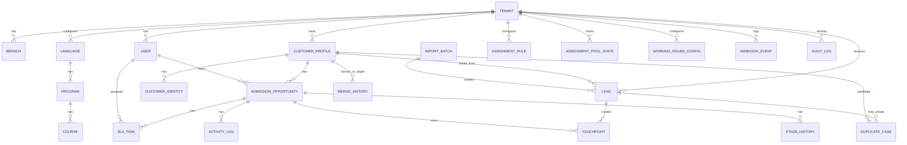
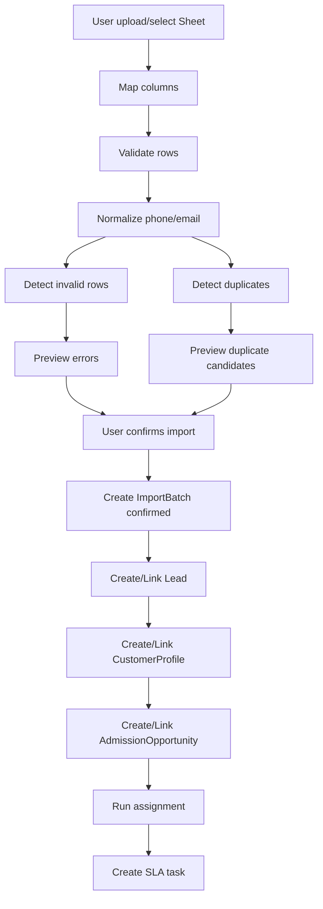
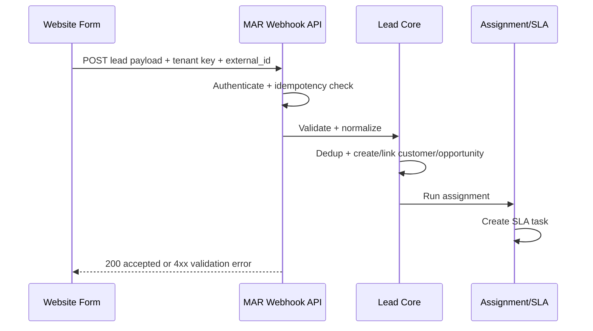
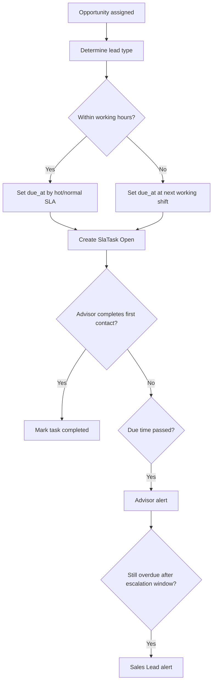

# R1A Technical BA Spec - Lead & Pipeline Core

> Phiên bản cập nhật: `v2.1 - Architecture version/convention lock - 2026-06-29`.
> Baseline kỹ thuật hiện hành: `Java + Spring Boot ecosystem`, `PostgreSQL`, `Flyway`, `Spring Data JPA/Hibernate`.
> Ghi chú: file này đã được đồng bộ theo quyết định chọn Spring Boot và MAR-ARCH-1.0; development commitment vẫn phụ thuộc sign-off `SP1-D01` đến `SP1-D10`.
## 1. Trạng thái tài liệu

| Thuộc tính | Giá trị |
|---|---|
| Tên tài liệu | R1A Technical BA Spec - Lead & Pipeline Core |
| Vai trò tài liệu | Đầu vào BA kỹ thuật cho PO/Tech Lead grooming |
| Nguồn baseline | `brief.md`, `03-r1-story-specs.md` |
| Trạng thái | Ready for PO/Tech grooming, not yet approved for development |
| Phạm vi | R1A - Tenant, Config, Lead Capture, Dedup, Opportunity, Pipeline, Assignment, SLA |
| Ngày lập | 2026-06-29 |

Tài liệu này chưa phải final technical design. Mục tiêu là làm rõ nghiệp vụ, dữ liệu, API baseline, validation, permission và test scenarios để Solution Architect/Tech Lead có thể thiết kế kiến trúc, database, API contract và backlog dev.

## 2. R1A Goal

R1A phải chứng minh được lõi vận hành lead-to-pipeline:

```text
Tenant setup
-> Language/Program/Course config
-> Lead import / webhook / Meta
-> Normalize & validate
-> Dedup
-> Customer Profile
-> Admission Opportunity
-> Assignment
-> SLA task
-> Pipeline stage management
```

R1A chưa xử lý sâu appointment, payment, revenue attribution và dashboard tài chính. Tuy nhiên R1A phải tạo đúng nền dữ liệu để R1B/R1C nối tiếp mà không phải phá lại model.

## 3. R1A In Scope

| Nhóm | In scope |
|---|---|
| Tenant setup | Tenant, branch, user, role, permission matrix cơ bản |
| Config | Language, program, course ở mức đủ để lead/opportunity gắn đúng |
| Lead capture | CSV/Google Sheet import, website form webhook, Meta Lead Ads webhook baseline |
| Import quality | Mapping, preview validation, duplicate preview, confirm import, import history |
| Dedup | Phone exact auto-link, email/Zalo/near match possible duplicate, merge/unmerge |
| Customer profile | Tạo hoặc link CustomerProfile sau dedup |
| Admission opportunity | Tạo opportunity theo language/program/course |
| Pipeline | Stage mặc định, allowed transition, lost reason, stage history |
| Assignment | Rule-based assignment, fallback round-robin, unassigned queue |
| SLA | SLA task, due time, overdue alert mức Advisor/Sales Lead |
| Audit tối thiểu | Permission change, import confirm, merge/unmerge, reassign, stage change quan trọng |

## 4. R1A Out of Scope

- Appointment booking và appointment reminder chi tiết.
- Payment, deposit, enrollment và revenue.
- Ad cost import và ROAS.
- Dashboard P0 đầy đủ.
- Full message journey builder.
- AI/ML lead scoring.
- Payment gateway.
- Field-level permission sâu.
- Native mobile app.

## 5. Actor và quyền chính

| Actor | Nhiệm vụ trong R1A |
|---|---|
| Admin | Cấu hình tenant, branch, user, role, permission, language, program, course; xử lý merge/unmerge; xem toàn tenant |
| Marketing | Import lead, cấu hình/kết nối nguồn lead nếu được cấp quyền, xem lead marketing |
| Sales Lead | Xem lead team, cấu hình assignment/pipeline nếu được cấp quyền, reassign, xử lý duplicate trong scope |
| Advisor | Xem lead/opportunity được giao, cập nhật stage, ghi note, xử lý task SLA |
| CEO | Xem dữ liệu tổng quan/tenant nếu UI có ở R1A; không trực tiếp thao tác vận hành |
| System | Nhận webhook, validate, dedup, tạo customer/opportunity, assign, tạo SLA task, tạo event |

## 6. Business Object Boundary

| Object | Vai trò nghiệp vụ | Không được hiểu nhầm thành |
|---|---|---|
| Lead | Inbound signal/source record từ form, ads, import | Deal hoặc cơ hội bán hàng |
| CustomerProfile | Hồ sơ người liên hệ đã hợp nhất sau dedup | Enrollment hoặc học viên đã đóng phí |
| CustomerIdentity | Định danh liên hệ của customer: phone, email, Zalo ID, Facebook ID, platform ID | Field phụ nằm rải rác trong Lead |
| AdmissionOpportunity | Cơ hội tuyển sinh theo language/program/course | Lead thô |
| Touchpoint | Lần tương tác/nguồn tạo lead phục vụ attribution sau này | Message log |
| Activity/InteractionLog | Hoạt động tư vấn hoặc tương tác: gọi, nhắn, email, note, system event | StageHistory hoặc MessageLog |
| DuplicateCase | Case nghi trùng cần review | Business pipeline stage |
| StageHistory | Lịch sử chuyển stage của opportunity | Audit log tổng quát |
| SlaTask | Việc cần xử lý để đạt SLA | Appointment |
| WorkingHoursConfig | Lịch làm việc tối thiểu để tính SLA trong/ngoài giờ | AssignmentRule |
| WebhookEvent/IntegrationLog | Log nhận/xử lý payload từ form, Meta hoặc integration | Lead hoặc ImportBatch |

Nguyên tắc khóa:

- Dedup/Merge không nằm trong business pipeline.
- Lead có thể nhiều, CustomerProfile có thể một, AdmissionOpportunity có thể nhiều.
- CustomerIdentity là nơi chuẩn để lưu nhiều phone/email/Zalo/Facebook/platform ID của cùng một customer.
- Activity/InteractionLog là nguồn đo first response, contact success và follow-up; không suy luận các KPI này chỉ từ stage.
- Opportunity là entity chính để Sales xử lý pipeline.

## 7. ERD mức BA cho R1A



## 8. Entity Specification

### 8.1. Tenant

| Field | Type gợi ý | Required | Rule |
|---|---|---|---|
| tenant_id | UUID | Yes | Sinh bởi hệ thống |
| tenant_name | Text | Yes | Không rỗng |
| timezone | Text | Yes | Default `Asia/Ho_Chi_Minh` |
| default_currency | Text | Yes | Default `VND` nếu pilot Việt Nam |
| status | Enum | Yes | `Active`, `Inactive` |
| created_at | Timestamp | Yes | Theo timezone hệ thống |
| updated_at | Timestamp | Yes | Tự cập nhật |

Validation:

- Tenant inactive không được nhận lead active từ import/webhook.
- Không cho xóa tenant nếu đã có dữ liệu; chỉ inactive.

### 8.2. Branch

| Field | Type gợi ý | Required | Rule |
|---|---|---|---|
| branch_id | UUID | Yes | Sinh bởi hệ thống |
| tenant_id | UUID | Yes | FK Tenant |
| branch_name | Text | Yes | Unique trong tenant nếu active |
| city | Text | Optional | Dùng cho routing nếu có |
| address | Text | Optional | |
| status | Enum | Yes | `Active`, `Inactive` |

Validation:

- Branch inactive không được chọn cho lead/opportunity mới.
- Lead không có branch vẫn được nhận và đi qua fallback assignment.

### 8.3. User

| Field | Type gợi ý | Required | Rule |
|---|---|---|---|
| user_id | UUID | Yes | Sinh bởi hệ thống |
| tenant_id | UUID | Yes | FK Tenant |
| full_name | Text | Yes | |
| email | Text | Optional | Unique trong tenant nếu có |
| phone | Text | Optional | Normalize nếu dùng login/contact |
| role | Enum | Yes | CEO, Admin, Marketing, Sales Lead, Advisor, CSKH, Finance |
| branch_ids | Array/Join table | Optional | Một user có thể thuộc nhiều branch |
| team_id | UUID | Optional | P0 có thể để null nếu chưa có team entity |
| status | Enum | Yes | Active, Inactive |

Validation:

- User inactive không nhận assignment mới.
- Advisor cần ít nhất một branch hoặc pool mặc định nếu dùng assignment theo branch.

### 8.4. PermissionProfile

| Field | Type gợi ý | Required | Rule |
|---|---|---|---|
| permission_id | UUID | Yes | |
| tenant_id | UUID | Yes | |
| role | Enum | Yes | |
| function_code | Text | Yes | Ví dụ `lead.import`, `lead.reassign` |
| access_level | Enum | Yes | `None`, `View`, `Create`, `Update`, `Manage` |
| scope | Enum | Yes | `Tenant`, `Branch`, `Team`, `Own`, `None` |

Validation:

- Advisor không được export data.
- Marketing không được ghi payment.
- Permission change phải ghi AuditLog.

### 8.5. Language

| Field | Type gợi ý | Required | Rule |
|---|---|---|---|
| language_id | UUID | Yes | |
| tenant_id | UUID | Yes | |
| name | Text | Yes | Anh, Nhật, Trung hoặc custom |
| code | Text | Optional | EN, JA, ZH hoặc custom |
| status | Enum | Yes | Active, Inactive |

Validation:

- Không hard-code IELTS/JLPT/HSK vào language.
- Language inactive không được chọn cho lead/opportunity mới.

### 8.6. Program

| Field | Type gợi ý | Required | Rule |
|---|---|---|---|
| program_id | UUID | Yes | |
| tenant_id | UUID | Yes | |
| language_id | UUID | Yes | FK Language active |
| program_name | Text | Yes | Ví dụ IELTS, JLPT N5, HSK, Giao tiếp |
| exam_track | Text | Optional | Không dùng để hard-code workflow |
| status | Enum | Yes | Active, Inactive |

Validation:

- Program phải thuộc language active.
- Program inactive không được chọn cho opportunity mới.

### 8.7. Course

| Field | Type gợi ý | Required | Rule |
|---|---|---|---|
| course_id | UUID | Yes | |
| tenant_id | UUID | Yes | |
| program_id | UUID | Yes | FK Program active |
| course_name | Text | Yes | |
| level | Text | Optional | |
| tuition_gross | Decimal | Optional | Không âm nếu có |
| currency | Text | Optional | Default từ tenant |
| status | Enum | Yes | Active, Inactive |

Validation:

- Không xóa course đã có opportunity/enrollment sau này; chỉ inactive.
- R1A chỉ cần đủ để opportunity gắn course optional.

### 8.8. Lead

| Field | Type gợi ý | Required | Rule |
|---|---|---|---|
| lead_id | UUID | Yes | Sinh bởi hệ thống |
| tenant_id | UUID | Yes | FK Tenant |
| external_id | Text | Optional | Dùng idempotency cho webhook/source |
| full_name | Text | Recommended | |
| phone_raw | Text | Optional | |
| phone_normalized | Text | Conditional | Tạo từ phone_raw nếu có |
| email | Text | Optional | Lowercase/trim |
| zalo_id | Text | Optional | |
| source_type | Enum | Yes | `CSV`, `GOOGLE_SHEET`, `WEBSITE_FORM`, `META_LEAD_ADS`, `MANUAL`, `OTHER` |
| source | Text | Recommended | Bắt buộc nếu marketing lead |
| source_created_at | Timestamp | Optional | Thời điểm lead ở nguồn |
| language_id | UUID | Optional | |
| program_id | UUID | Optional | |
| branch_id | UUID | Optional | |
| campaign | Text | Optional | |
| adset | Text | Optional | |
| ad | Text | Optional | |
| utm_source | Text | Optional | |
| utm_medium | Text | Optional | |
| utm_campaign | Text | Optional | |
| consent_consultation | Enum | Optional | `GRANTED`, `DENIED`, `UNKNOWN`, `REVOKED` |
| consent_marketing | Enum | Optional | `GRANTED`, `DENIED`, `UNKNOWN`, `REVOKED` |
| contactability | Enum | Yes | High, Medium, Low |
| lead_temperature | Enum | Optional | HOT, NORMAL, AFTER_HOURS |
| temperature_reason | Text | Optional | Lý do đánh dấu hot/normal/after-hours |
| import_batch_id | UUID | Optional | FK ImportBatch |
| raw_payload_id | UUID/Text | Optional | Link raw payload nếu lưu |
| lead_status | Enum | Yes | Valid, Invalid, Linked, DuplicateReview |
| created_at | Timestamp | Yes | |

Validation:

- Hợp lệ nếu có ít nhất một trong `phone_normalized`, `email`, `zalo_id`.
- Thiếu cả ba thì không tạo lead valid; đưa vào error/invalid.
- Phone phải normalize trước khi dedup.
- Email phải trim/lowercase.
- Source bắt buộc với lead từ marketing import/webhook nếu payload có source.

### 8.9. CustomerProfile

| Field | Type gợi ý | Required | Rule |
|---|---|---|---|
| customer_id | UUID | Yes | |
| tenant_id | UUID | Yes | |
| full_name | Text | Recommended | Ưu tiên từ lead mới nhất hoặc profile đã xác nhận |
| primary_phone | Text | Optional | Normalized |
| primary_email | Text | Optional | Lowercase |
| zalo_id | Text | Optional | |
| guardian_name | Text | Optional | |
| guardian_phone | Text | Optional | |
| preferred_channel | Enum | Optional | Zalo, SMS, Email, Call |
| created_at | Timestamp | Yes | |
| updated_at | Timestamp | Yes | |

Validation:

- CustomerProfile cũng cần ít nhất một contact identifier nếu tạo mới từ lead.
- Không merge customer khác tenant.
- `primary_phone`, `primary_email`, `zalo_id` chỉ là snapshot/shortcut cho UI và tìm kiếm nhanh; nguồn đầy đủ phải nằm ở CustomerIdentity.

### 8.9A. CustomerIdentity

| Field | Type gợi ý | Required | Rule |
|---|---|---|---|
| identity_id | UUID | Yes | |
| tenant_id | UUID | Yes | FK Tenant |
| customer_id | UUID | Yes | FK CustomerProfile |
| identity_type | Enum | Yes | PHONE, EMAIL, ZALO_ID, FACEBOOK_ID, COOKIE_ID, PLATFORM_ID, GUARDIAN_PHONE, LEARNER_PHONE |
| raw_value | Text | Yes | Giá trị gốc từ source |
| normalized_value | Text | Yes | Giá trị chuẩn hóa dùng dedup/search |
| is_primary | Boolean | Yes | Một loại identity nên có tối đa một primary |
| verified_status | Enum | Yes | VERIFIED, UNVERIFIED, UNKNOWN |
| source | Enum/Text | Yes | IMPORT, FORM, META, ZALO, MANUAL |
| created_at | Timestamp | Yes | |
| updated_at | Timestamp | Optional | |

Validation:

- `normalized_value` phải unique tương đối theo `tenant_id + identity_type` nếu verified; các case không chắc chắn vẫn đi qua DuplicateCase.
- Một customer có thể có nhiều phone/email/Zalo/platform identity.
- Guardian phone và learner phone không được ép merge mù nếu chưa có xác nhận.
- Khi CustomerProfile đổi primary phone/email, phải cập nhật hoặc chọn lại CustomerIdentity tương ứng.

### 8.10. AdmissionOpportunity

| Field | Type gợi ý | Required | Rule |
|---|---|---|---|
| opportunity_id | UUID | Yes | |
| tenant_id | UUID | Yes | |
| customer_id | UUID | Yes | FK CustomerProfile |
| source_lead_id | UUID | Yes | Lead tạo opportunity |
| language_id | UUID | Optional | Nên có nếu lead có language |
| program_id | UUID | Optional | Nên có nếu lead có program |
| course_id | UUID | Optional | |
| branch_id | UUID | Optional | |
| owner_id | UUID | Optional | Sau assignment |
| current_stage | Enum | Yes | Default `New` |
| qualification_status | Enum | Optional | Unqualified, Qualified, Unknown |
| lead_temperature | Enum | Optional | HOT, NORMAL, AFTER_HOURS, nếu muốn snapshot ở opportunity |
| sla_policy_id | UUID/Text | Optional | Policy SLA dùng khi tạo SlaTask |
| lost_reason | Enum | Optional | Bắt buộc khi stage Lost |
| lost_note | Text | Optional | Bắt buộc nếu reason Khác |
| first_touch_id | UUID | Optional | Chuẩn bị cho R1C |
| last_touch_id | UUID | Optional | Chuẩn bị cho R1C |
| created_at | Timestamp | Yes | |
| updated_at | Timestamp | Yes | |

Validation:

- Một customer có thể có nhiều opportunity.
- Nếu customer có active opportunity cùng program, lead mới nên gắn vào opportunity hiện có hoặc tạo touchpoint theo rule tenant.
- Nếu customer quan tâm program khác, tạo opportunity mới.

### 8.11. Touchpoint

| Field | Type gợi ý | Required | Rule |
|---|---|---|---|
| touchpoint_id | UUID | Yes | |
| tenant_id | UUID | Yes | |
| customer_id | UUID | Yes | |
| lead_id | UUID | Yes | |
| opportunity_id | UUID | Optional | Có thể gắn sau khi opportunity tạo |
| source | Text | Optional | |
| campaign | Text | Optional | |
| adset | Text | Optional | |
| ad | Text | Optional | |
| utm_source | Text | Optional | |
| utm_medium | Text | Optional | |
| utm_campaign | Text | Optional | |
| touch_time | Timestamp | Yes | source_created_at hoặc created_at |
| touch_type | Enum | Yes | Import, Form, Meta, Manual |

Validation:

- Touchpoint phải được tạo cho lead valid đã link/tạo customer.
- First-touch là touchpoint sớm nhất của opportunity/customer theo rule.
- Last-touch là touchpoint mới nhất trước conversion, sẽ dùng ở R1C.

### 8.12. ImportBatch

| Field | Type gợi ý | Required | Rule |
|---|---|---|---|
| import_batch_id | UUID | Yes | |
| tenant_id | UUID | Yes | |
| import_type | Enum | Yes | Lead, Payment, AdCost; R1A dùng Lead |
| source_file_name | Text | Optional | |
| source_uri | Text | Optional | File hoặc Google Sheet URL/id |
| mapping_config | JSON | Yes | Source column -> system field |
| total_rows | Integer | Yes | |
| valid_count | Integer | Yes | |
| created_count | Integer | Yes | Sau confirm |
| updated_count | Integer | Yes | Sau confirm |
| skipped_count | Integer | Yes | |
| error_count | Integer | Yes | |
| duplicate_count | Integer | Yes | |
| status | Enum | Yes | `DRAFT`, `PREVIEWED`, `CONFIRMED`, `COMPLETED`, `FAILED`, `CANCELLED` |
| imported_by | UUID | Yes | |
| imported_at | Timestamp | Yes | |
| completed_at | Timestamp | Optional | |
| error_report_uri | Text | Optional | |

Validation:

- Không ghi lead chính thức trước confirm.
- Mapping config phải được giữ lại để audit.
- Confirm import phải ghi AuditLog.

### 8.13. DuplicateCase

| Field | Type gợi ý | Required | Rule |
|---|---|---|---|
| duplicate_case_id | UUID | Yes | |
| tenant_id | UUID | Yes | |
| lead_id | UUID | Yes | |
| candidate_customer_id | UUID | Optional | |
| match_type | Enum | Yes | `PHONE_EXACT`, `EMAIL_EXACT_PHONE_DIFFERENT`, `ZALO_EXACT`, `NEAR_MATCH`, `MANUAL` |
| confidence | Enum/Decimal | Optional | `HIGH`, `MEDIUM`, `LOW` hoặc score |
| status | Enum | Yes | `NEEDS_REVIEW`, `MERGED`, `LINKED`, `IGNORED`, `UNMERGED` |
| reviewed_by | UUID | Optional | |
| reviewed_at | Timestamp | Optional | |
| resolution_note | Text | Optional | Required khi merge/ignore |

Validation:

- Possible duplicate không được auto-merge.
- Admin/Sales Lead mới được resolve.
- Không tạo duplicate chỉ vì trùng tên.

### 8.14. MergeHistory

| Field | Type gợi ý | Required | Rule |
|---|---|---|---|
| merge_id | UUID | Yes | |
| tenant_id | UUID | Yes | |
| source_customer_id | UUID | Yes | Customer bị merge |
| target_customer_id | UUID | Yes | Customer giữ lại |
| merged_by | UUID | Yes | |
| merged_at | Timestamp | Yes | |
| reason | Text | Yes | |
| can_unmerge | Boolean | Yes | Default true nếu chưa có dữ liệu không thể tách |
| unmerged_by | UUID | Optional | |
| unmerged_at | Timestamp | Optional | |

Validation:

- Source và target phải cùng tenant.
- Không cho merge customer vào chính nó.
- Unmerge phải ghi AuditLog.

### 8.15. StageHistory

| Field | Type gợi ý | Required | Rule |
|---|---|---|---|
| stage_history_id | UUID | Yes | |
| tenant_id | UUID | Yes | |
| opportunity_id | UUID | Yes | |
| from_stage | Enum | Optional | Null nếu tạo opportunity |
| to_stage | Enum | Yes | |
| changed_by | UUID/System | Yes | |
| changed_at | Timestamp | Yes | |
| reason | Text | Optional | Required cho một số transition |
| duration_in_previous_stage | Duration | Optional | Tính khi chuyển stage |

Validation:

- StageHistory chỉ append, không sửa tay từ UI thường.
- Mọi stage change đều tạo StageHistory.

### 8.16. AssignmentRule

| Field | Type gợi ý | Required | Rule |
|---|---|---|---|
| rule_id | UUID | Yes | |
| tenant_id | UUID | Yes | |
| priority | Integer | Yes | Nhỏ hơn chạy trước |
| language_id | UUID | Optional | |
| program_id | UUID | Optional | |
| branch_id | UUID | Optional | |
| shift | Text/Enum | Optional | Working hour hoặc after-hours |
| advisor_ids | Array/Join table | Yes | Pool advisor |
| is_active | Boolean | Yes | |
| created_by | UUID | Yes | |
| updated_at | Timestamp | Yes | |

Validation:

- Advisor trong rule phải active.
- Priority không trùng trong cùng tenant nếu rule set yêu cầu thứ tự tuyệt đối.
- Rule inactive không chạy.

### 8.17. SlaTask

| Field | Type gợi ý | Required | Rule |
|---|---|---|---|
| task_id | UUID | Yes | |
| tenant_id | UUID | Yes | |
| opportunity_id | UUID | Yes | |
| owner_id | UUID | Yes | Advisor |
| task_type | Enum | Yes | FirstContact, FollowUp, OverdueReview |
| due_at | Timestamp | Yes | Theo timezone tenant |
| status | Enum | Yes | `OPEN`, `COMPLETED`, `OVERDUE`, `CANCELLED` |
| completed_at | Timestamp | Optional | |
| overdue_level | Enum | Optional | None, AdvisorAlerted, SalesLeadAlerted |
| escalated_to | UUID | Optional | Sales Lead |
| sla_policy_id | UUID/Text | Optional | Policy dùng để tính due_at |
| created_at | Timestamp | Yes | |

Validation:

- Hot lead: 5-15 phút.
- Normal lead: 30-60 phút.
- Ngoài giờ: task đầu ca hôm sau theo WorkingHoursConfig.
- R1A chưa tự động đổi owner khi overdue.

### 8.18. ActivityLog / InteractionLog

| Field | Type gợi ý | Required | Rule |
|---|---|---|---|
| activity_id | UUID | Yes | |
| tenant_id | UUID | Yes | FK Tenant |
| opportunity_id | UUID | Yes | FK AdmissionOpportunity |
| customer_id | UUID | Yes | FK CustomerProfile |
| actor_id | UUID/System | Yes | Advisor hoặc System |
| activity_type | Enum | Yes | CALL, ZALO, SMS, EMAIL, NOTE, MEETING, SYSTEM |
| activity_result | Enum | Yes | ATTEMPTED, CONNECTED, REPLIED, NO_ANSWER, FAILED, SENT |
| occurred_at | Timestamp | Yes | Thời điểm hoạt động xảy ra |
| note | Text | Optional | Ghi chú |
| source | Enum/Text | Yes | MANUAL, SYSTEM, INTEGRATION |
| created_at | Timestamp | Yes | |

Validation:

- First response SLA hit dùng activity outbound hợp lệ đầu tiên trong SLA, không dùng stage `Contacting`.
- Contact success dùng `CONNECTED` hoặc `REPLIED`, không dùng mọi contact attempt.
- Note nghiệp vụ của advisor nên lưu thành ActivityLog type `NOTE` thay vì chỉ lưu text tự do trên Opportunity.

### 8.19. WorkingHoursConfig

| Field | Type gợi ý | Required | Rule |
|---|---|---|---|
| working_hours_id | UUID | Yes | |
| tenant_id | UUID | Yes | FK Tenant |
| branch_id | UUID | Optional | Null nghĩa là tenant default |
| weekday | Enum/Integer | Yes | MONDAY đến SUNDAY hoặc 1-7 |
| start_time | Time | Optional | Ví dụ 08:00 |
| end_time | Time | Optional | Ví dụ 18:00 |
| timezone | Text | Yes | Default tenant timezone |
| is_working_day | Boolean | Yes | |

Default pilot:

- Monday-Saturday.
- 08:00-18:00.
- Timezone lấy từ tenant, mặc định `Asia/Ho_Chi_Minh`.

Validation:

- Nếu không có WorkingHoursConfig tenant/branch, dùng default pilot và ghi warning cấu hình.
- SLA after-hours phải dựa trên WorkingHoursConfig, không hard-code rải rác trong service.

### 8.20. WebhookEvent / IntegrationLog

| Field | Type gợi ý | Required | Rule |
|---|---|---|---|
| event_id | UUID | Yes | |
| tenant_id | UUID | Yes | FK Tenant |
| source_type | Enum | Yes | WEBSITE_FORM, META_LEAD_ADS, OTHER |
| external_id | Text | Optional | ID nguồn |
| payload_hash | Text | Yes | Chống trùng/idempotency |
| status | Enum | Yes | RECEIVED, ACCEPTED, PROCESSED, FAILED, DUPLICATE |
| error_code | Text | Optional | |
| error_message | Text | Optional | |
| received_at | Timestamp | Yes | |
| processed_at | Timestamp | Optional | |
| raw_payload_uri | Text | Optional | Link payload đã mask/encrypt nếu lưu |

Validation:

- Webhook retry cùng `tenant_id + source_type + external_id/payload_hash` không tạo lead trùng.
- Raw payload có PII phải có access control, masking/encryption và retention ngắn.

### 8.21. AssignmentPoolState

| Field | Type gợi ý | Required | Rule |
|---|---|---|---|
| pool_state_id | UUID | Yes | |
| tenant_id | UUID | Yes | FK Tenant |
| pool_key | Text | Yes | Ví dụ language/program/branch/shift hoặc fallback |
| last_assigned_user_id | UUID | Optional | Advisor cuối cùng được round-robin |
| updated_at | Timestamp | Yes | |

Validation:

- Fallback round-robin phải dùng AssignmentPoolState hoặc cơ chế tương đương để tránh phân phối không ổn định.
- Pool key phải deterministic để cùng một rule set dùng cùng con trỏ.

## 9. State và Enum Baseline

### 9.1. Lead status

| Status | Ý nghĩa |
|---|---|
| Valid | Lead hợp lệ, có ít nhất một contact identifier |
| Invalid | Lead thiếu contact identifier hoặc lỗi dữ liệu nghiêm trọng |
| Linked | Lead đã được link vào customer |
| DuplicateReview | Lead/case cần review duplicate |
| Skipped | Row bị bỏ qua khi import |

### 9.2. Opportunity stage mặc định

```text
New
-> Contacting
-> Contacted
-> Qualified
-> Program Selected
-> Appointment Booked
-> Appointment Done / No-show
-> Consulting
-> Deposit Paid
-> Enrolled
-> Lost
-> Nurturing
```

Trong R1A, các stage sau có thể tồn tại để giữ model thống nhất nhưng chưa triển khai toàn bộ nghiệp vụ: `Appointment Booked`, `Appointment Done`, `No-show`, `Deposit Paid`, `Enrolled`.

### 9.3. Lost reason mặc định

| Lost reason | Ghi chú |
|---|---|
| Không liên hệ được | Gọi/nhắn không phản hồi |
| Không có nhu cầu | Không còn muốn học |
| Sai đối tượng | Không phù hợp chương trình |
| Sai khu vực | Không phù hợp cơ sở |
| Học phí cao | Không phù hợp ngân sách |
| Lịch học không phù hợp | Không khớp thời gian |
| Chọn đối thủ | Đăng ký nơi khác |
| Chưa sẵn sàng | Có nhu cầu nhưng chưa học ngay |
| Lead rác/spam | Không hợp lệ |
| Khác | Bắt buộc ghi note |

### 9.4. Enum key convention

API/DB phải dùng enum key ổn định dạng `UPPER_SNAKE_CASE`; UI label có thể là tiếng Việt/Anh tùy tenant.

| Loại | API/DB key | UI label ví dụ |
|---|---|---|
| Role | SALES_LEAD | Sales Lead / Trưởng nhóm tuyển sinh |
| Stage | APPOINTMENT_BOOKED | Appointment Booked / Đã đặt lịch |
| Lost reason | TUITION_TOO_HIGH | Học phí cao |
| Source type | META_LEAD_ADS | Meta Lead Ads |
| Consent status | GRANTED | Đã đồng ý |

Không dùng label có dấu, khoảng trắng hoặc ngôn ngữ hiển thị làm key trong API/DB.

### 9.5. Consent status

Consent không dùng boolean vì cần phân biệt trạng thái chưa biết và đã thu hồi.

```text
GRANTED
DENIED
UNKNOWN
REVOKED
```

## 10. Pipeline Transition Rules

| From | To allowed | Required validation |
|---|---|---|
| New | Contacting, Lost | Lost cần reason |
| Contacting | Contacted, Lost, Nurturing | Lost cần reason |
| Contacted | Qualified, Lost, Nurturing | Qualified cần contactable + nhu cầu rõ |
| Qualified | Program Selected, Appointment Booked, Consulting, Lost | Lost cần reason |
| Program Selected | Appointment Booked, Consulting, Lost | Program phải có |
| Appointment Booked | Appointment Done, No-show, Cancelled | R1B xử lý chi tiết |
| Appointment Done | Consulting, Deposit Paid, Enrolled, Lost | R1B/R1C xử lý sâu |
| No-show | Contacting, Nurturing, Lost | Lost cần reason |
| Consulting | Deposit Paid, Enrolled, Lost, Nurturing | R1B xử lý sâu |
| Deposit Paid | Enrolled, Lost, Refunded | R1B xử lý sâu |
| Enrolled | Chỉ Admin/Finance chỉnh ngược | Cần reason và AuditLog |
| Lost | Reopen bởi Sales Lead/Admin | Cần reopen reason |
| Nurturing | Contacting, Qualified, Lost | Lost cần reason |

System rule:

- Transition không hợp lệ phải bị chặn ở cả UI và API.
- Mỗi transition hợp lệ phải tạo StageHistory.
- Nếu transition có thay đổi owner hoặc stage nhạy cảm, tạo AuditLog.

## 11. Lead Capture Flow

### 11.1. CSV/Google Sheet import



Key rules:

- Preview không ghi dữ liệu chính thức.
- Confirm mới tạo/cập nhật Lead, CustomerProfile, Opportunity.
- Error rows cần downloadable report hoặc ít nhất có row number + reason.
- Duplicate preview phải cho biết match type.

### 11.2. Website form webhook



Key rules:

- Realtime lead phải được xử lý đủ để có owner/SLA nếu dữ liệu hợp lệ.
- Idempotency theo `external_id`; nếu không có thì dùng payload hash theo tenant/source.
- Payload lỗi phải trả reason đủ rõ.

### 11.3. Meta Lead Ads webhook

Key rules:

- Source mặc định `Meta`.
- Lưu campaign/adset/ad nếu payload có.
- Lead Meta được xử lý như hot lead nếu tenant config hoặc source rule đánh dấu hot.
- Lỗi integration cần log để Marketing/Admin kiểm tra.

## 12. Dedup Decision Table

| Input case | Action | CustomerProfile | Opportunity | DuplicateCase |
|---|---|---|---|---|
| Phone exact match sau normalize | Auto-link | Dùng customer hiện có | Tạo mới nếu program khác; gắn existing nếu cùng active program | Không bắt buộc |
| Email exact, phone trống và customer chỉ có email | Auto-link nếu tenant cho phép | Dùng customer hiện có | Theo program | Có thể không cần |
| Email exact nhưng phone khác | Possible duplicate | Chưa merge | Chưa auto tạo nếu rủi ro cao; hoặc tạo opportunity pending review theo quyết định Tech/PO | Tạo `NEEDS_REVIEW` |
| Zalo ID exact đã xác thực | Auto-link | Dùng customer hiện có | Theo program | Không bắt buộc |
| Zalo ID exact chưa xác thực | Possible duplicate | Chưa merge | Pending/review | Tạo `NEEDS_REVIEW` |
| Họ tên gần giống + phone gần giống | Possible duplicate | Chưa merge | Pending/review | Tạo `NEEDS_REVIEW` |
| Chỉ trùng tên | Không merge | Tạo customer mới nếu contact identifier khác | Tạo opportunity mới | Không |
| Không có phone/email/Zalo ID | Invalid | Không tạo | Không tạo | Không |

Điểm cần PO/Tech Lead chốt thêm:

- Với case email exact nhưng phone khác, hệ thống nên tạo opportunity pending review hay chỉ tạo DuplicateCase? Khuyến nghị BA: tạo DuplicateCase, không đưa vào pipeline chính cho đến khi review nếu rủi ro merge cao.

## 13. Assignment Rule

### 13.1. Priority

```text
Language
-> Program
-> Branch
-> Shift / working hour
-> Workload
-> Fallback round-robin
```

### 13.2. Assignment pseudo-rule mức BA

```text
Input: opportunity, lead, tenant config

1. Find active rules in tenant ordered by priority.
2. Filter rules by matching language/program/branch/shift.
3. Build eligible advisor pool from matched rule.
4. Remove inactive users.
5. Remove users outside allowed branch if branch restriction is on.
6. Choose advisor with lowest active workload or round-robin pointer.
7. If no rule matches, use fallback round-robin pool.
8. If no advisor eligible, put opportunity into Unassigned Queue.
9. Create owner.assigned event if assigned.
10. Create SLA task based on lead temperature and working hours.
```

### 13.3. Lead temperature baseline

| Lead type | Criteria gợi ý | SLA |
|---|---|---|
| Hot | Website form tư vấn học phí, đăng ký test, Meta form có nhu cầu học ngay, Google Search nếu có sau này | 5-15 phút |
| Normal | Import thường, lead cũ, form chung | 30-60 phút |
| After-hours | Lead đến ngoài giờ làm tenant | Auto confirmation nếu consent hợp lệ + task đầu ca hôm sau |

R1A cần để tenant cấu hình SLA cụ thể trong khoảng approved hoặc dùng default.

## 14. SLA Flow



Completion rule:

- First response SLA hit được hoàn thành khi Advisor/System ghi outbound ActivityLog hợp lệ đầu tiên trong SLA: `CALL` attempted, `ZALO` sent, `SMS` sent, `EMAIL` sent hoặc manual contact attempt hợp lệ.
- `Contacted` stage chỉ dùng cho contact success: khách thật sự nghe máy, trả lời, xác nhận hoặc phản hồi.
- `Contacting` chỉ là đã bắt đầu xử lý, không được tính là contact success.
- Dashboard sau này cần tách `first_response_sla_hit_rate` và `contact_success_rate`.

## 15. API Baseline cho R1A

Tên endpoint là đề xuất BA để Tech Lead thiết kế contract chi tiết.

### 15.1. Tenant/config APIs

| Method | Endpoint | Actor | Mục đích |
|---|---|---|---|
| POST | `/tenants` | Admin | Tạo tenant |
| PATCH | `/tenants/{tenant_id}` | Admin | Sửa tenant/status |
| POST | `/branches` | Admin | Tạo branch |
| GET | `/branches` | Admin/Sales Lead | Danh sách branch theo scope |
| PATCH | `/branches/{branch_id}` | Admin | Sửa branch/status |
| POST | `/users` | Admin | Tạo user |
| GET | `/users` | Admin/Sales Lead | Danh sách user theo scope |
| GET | `/users/{user_id}` | Admin/Sales Lead | Chi tiết user |
| PATCH | `/users/{user_id}` | Admin | Sửa user/status/role |
| GET | `/permissions/matrix` | Admin | Xem permission matrix |
| PATCH | `/permissions/matrix` | Admin | Cập nhật permission |
| POST | `/languages` | Admin | Tạo language |
| GET | `/languages` | Admin/Marketing/Sales Lead | Danh sách language |
| PATCH | `/languages/{language_id}` | Admin | Sửa language/status |
| POST | `/programs` | Admin | Tạo program |
| GET | `/programs` | Admin/Marketing/Sales Lead | Danh sách program |
| PATCH | `/programs/{program_id}` | Admin | Sửa program/status |
| POST | `/courses` | Admin | Tạo course |
| GET | `/courses` | Admin/Finance/Sales Lead | Danh sách course |
| PATCH | `/courses/{course_id}` | Admin | Sửa course/status |
| GET | `/working-hours` | Admin/Sales Lead | Xem cấu hình giờ làm |
| PATCH | `/working-hours` | Admin | Cập nhật working hours tenant/branch |

### 15.2. Lead import APIs

| Method | Endpoint | Actor | Mục đích |
|---|---|---|---|
| POST | `/imports/leads/preview` | Admin/Marketing/Sales Lead có quyền | Upload/map và preview validation |
| POST | `/imports/leads/{batch_id}/confirm` | Người có quyền import | Confirm import |
| GET | `/imports/leads` | Người có quyền import | Xem lịch sử import |
| GET | `/imports/leads/{batch_id}` | Người có quyền import | Xem chi tiết batch |
| GET | `/imports/leads/{batch_id}/errors` | Người có quyền import | Xem/tải lỗi |
| GET | `/imports/leads/{batch_id}/created-records` | Người có quyền import | Xem/paginate records tạo/cập nhật sau confirm |

Preview response cần có:

| Field | Ý nghĩa |
|---|---|
| batch_id | ID import nháp |
| total_rows | Tổng row |
| valid_count | Row hợp lệ |
| error_count | Row lỗi |
| duplicate_count | Row/case nghi trùng |
| errors | Danh sách lỗi có row_number, field, reason |
| duplicate_candidates | Danh sách candidate có match_type |
| mapping_config | Mapping đã dùng |

### 15.3. Webhook APIs

| Method | Endpoint | Actor | Mục đích |
|---|---|---|---|
| POST | `/webhooks/leads/website` | Website/integration | Nhận lead website form |
| POST | `/webhooks/leads/meta` | Meta integration | Nhận Meta Lead Ads |
| GET | `/integrations/webhook-events` | Admin/Marketing | Danh sách webhook/integration events |
| GET | `/integrations/webhook-events/{event_id}` | Admin/Marketing | Chi tiết webhook/integration event |

Webhook validation:

- Authentication bằng tenant key/signature.
- Idempotency bằng `external_id` hoặc payload hash.
- Response 2xx chỉ khi payload accepted.
- 4xx cho validation/auth lỗi.
- 5xx cho lỗi hệ thống có thể retry.

### 15.4. Duplicate APIs

| Method | Endpoint | Actor | Mục đích |
|---|---|---|---|
| GET | `/duplicates` | Admin/Sales Lead | Danh sách possible duplicate |
| GET | `/duplicates/{case_id}` | Admin/Sales Lead | Chi tiết duplicate case |
| POST | `/duplicates/{case_id}/resolve` | Admin/Sales Lead | Merge/link/ignore |
| POST | `/customers/{customer_id}/unmerge` | Admin | Unmerge |
| GET | `/customers` | Admin/Sales Lead/Advisor theo scope | Tìm kiếm customer |
| GET | `/customers/{customer_id}` | Theo scope | Chi tiết customer |
| PATCH | `/customers/{customer_id}` | Admin/Sales Lead theo scope | Sửa thông tin customer |
| GET | `/customers/{customer_id}/identities` | Theo scope | Danh sách CustomerIdentity |

Resolve action:

```json
{
  "action": "merge | link | ignore",
  "target_customer_id": "uuid-if-needed",
  "reason": "required note"
}
```

### 15.5. Lead/opportunity APIs

| Method | Endpoint | Actor | Mục đích |
|---|---|---|---|
| GET | `/advisor/inbox` | Advisor | Xem lead/opportunity được giao |
| GET | `/opportunities` | Advisor/Sales Lead/Admin | Danh sách theo scope |
| GET | `/opportunities/{id}` | Theo scope | Chi tiết opportunity |
| PATCH | `/opportunities/{id}` | Theo scope | Cập nhật field nghiệp vụ |
| POST | `/opportunities/{id}/stage` | Theo scope | Chuyển stage |
| GET | `/opportunities/{id}/stage-history` | Theo scope | Xem stage history |
| POST | `/opportunities/{id}/activities` | Advisor/Sales Lead/Admin | Ghi call/note/message attempt |
| GET | `/opportunities/{id}/activities` | Theo scope | Xem activity timeline |
| POST | `/opportunities/{id}/reassign` | Admin/Sales Lead | Reassign owner |

Stage update request:

```json
{
  "to_stage": "Contacted",
  "reason": "optional except required transitions",
  "lost_reason": "required when to_stage is Lost",
  "lost_note": "required when lost_reason is Khac"
}
```

### 15.6. Assignment/SLA APIs

| Method | Endpoint | Actor | Mục đích |
|---|---|---|---|
| POST | `/assignment-rules` | Admin/Sales Lead | Tạo rule |
| GET | `/assignment-rules` | Admin/Sales Lead | Danh sách rule |
| PATCH | `/assignment-rules/{rule_id}` | Admin/Sales Lead | Sửa rule |
| PATCH | `/assignment-rules/{rule_id}/inactive` | Admin/Sales Lead | Inactive rule |
| POST | `/assignment-rules/test` | Admin/Sales Lead | Test rule với lead mẫu |
| GET | `/sla/tasks` | Advisor/Sales Lead/Admin | Xem SLA task theo scope |
| POST | `/sla/tasks/{task_id}/complete` | Owner/Admin | Hoàn tất task |
| GET | `/sla/overdue` | Sales Lead/Admin | Xem quá hạn |

## 16. Event Baseline cho R1A

| Event | Trigger | Consumer dự kiến |
|---|---|---|
| tenant.created | Admin tạo tenant | Audit/config |
| permission.updated | Admin đổi permission | Audit |
| lead.import.previewed | User preview import | Import monitoring |
| lead.import.confirmed | User confirm import | Audit, lead core |
| webhook.received | Hệ thống nhận payload webhook | Integration monitoring |
| webhook.processed | Payload webhook xử lý thành công | Lead core |
| webhook.failed | Payload webhook lỗi | Admin/Marketing debug |
| lead.created | Lead valid được tạo | Dedup, assignment |
| lead.invalid | Row/payload invalid | Import error/report |
| customer.created | Customer mới được tạo | Opportunity core |
| customer.linked | Lead auto-link vào customer | Touchpoint/opportunity |
| customer.identity.created | Thêm identity mới cho customer | Dedup/search |
| duplicate.detected | Có possible duplicate | Duplicate review |
| customer.merged | Duplicate được merge | Audit |
| customer.unmerged | Admin unmerge | Audit |
| opportunity.created | Opportunity mới được tạo | Assignment |
| activity.created | Advisor/System ghi interaction | SLA/contact KPI |
| owner.assigned | Opportunity có owner | SLA |
| opportunity.unassigned | Không tìm được owner | Sales Lead/Admin alert |
| opportunity.stage_changed | Stage đổi | StageHistory, dashboard sau này |
| sla.task_created | Tạo SLA task | Advisor inbox |
| sla.overdue | SLA quá hạn | Advisor/Sales Lead alert |

## 17. UI/UX Flow Baseline

### 17.1. Import lead

Màn hình tối thiểu:

- Upload file hoặc nhập Google Sheet URL.
- Mapping cột.
- Preview summary.
- Error preview.
- Duplicate preview.
- Confirm import.
- Import result.
- Import history.

Acceptance UI:

- Không có nút confirm nếu mapping thiếu điều kiện tối thiểu.
- Error preview phải chỉ ra row number và reason.
- Duplicate preview phải chỉ ra match type và candidate customer.

### 17.2. Duplicate review

Màn hình tối thiểu:

- Danh sách duplicate case.
- Bộ lọc status, source, match type.
- So sánh lead mới và customer candidate.
- Action: merge, link, ignore.
- Note/reason bắt buộc.
- Lịch sử merge/unmerge.

### 17.3. Advisor inbox

Màn hình tối thiểu:

- Danh sách opportunity được giao.
- SLA due time và overdue status.
- Current stage.
- Contact identifiers.
- Next action.
- Quick action: mark Contacting/Contacted/Lost/Nurturing.

### 17.4. Pipeline detail

Màn hình tối thiểu:

- Customer summary.
- Lead/touchpoint summary.
- Opportunity field.
- Stage selector theo allowed transition.
- Lost reason modal.
- Stage history timeline.
- Activity timeline: call attempt, connected/replied, Zalo/SMS/email attempt, note.
- Owner/reassign nếu có quyền.

### 17.5. Assignment rule

Màn hình tối thiểu:

- Rule list theo priority.
- Rule form: language, program, branch, shift, advisor pool, active.
- Test assignment với lead mẫu.
- Fallback pool config.

### 17.6. Working hours config

Màn hình tối thiểu:

- Tenant default working days.
- Start/end time.
- Timezone.
- Branch override nếu tenant cần.
- Preview after-hours behavior.

### 17.7. Integration log

Màn hình tối thiểu:

- Danh sách webhook events.
- Source type, external_id, status, received_at, processed_at.
- Error code/message.
- Raw payload access có permission và masking.

## 18. Permission Matrix cho R1A

| Function | CEO | Admin | Marketing | Sales Lead | Advisor | CSKH | Finance |
|---|---|---|---|---|---|---|---|
| Tenant setup | View | Manage | No | No | No | No | No |
| Branch setup | View | Manage | No | View | No | No | No |
| User setup | View | Manage | No | View team | No | No | No |
| Permission setup | No/View | Manage | No | No | No | No | No |
| Language/program/course setup | View | Manage | View | View | View | View | View |
| Import lead | No | Manage | Create | Create if allowed | No | No | No |
| View all leads | View | View | View marketing scope | View team/branch | Own only | Limited | No |
| Duplicate review | No | Manage | No | Manage team/branch | No | No | No |
| Merge/unmerge | No | Manage | No | Merge if allowed, unmerge if configured | No | No | No |
| Advisor inbox | No | View tenant | No | View team | Own | Limited | No |
| Update opportunity stage | No | Manage | No | Manage team | Own | Limited if configured | No |
| Reassign owner | No | Manage | No | Manage team | No | No | No |
| Assignment rule | No | Manage | No | Manage team/branch | No | No | No |
| SLA task | No | View tenant | No | View team | Own | Limited | No |

## 19. Validation Rule Catalog

| Rule ID | Rule | Applies to | Error behavior |
|---|---|---|---|
| VAL-R1A-001 | Lead phải có phone/email/Zalo ID | Lead import/webhook | Reject row/payload hoặc invalid lead |
| VAL-R1A-002 | Phone phải normalize trước dedup | Lead | Nếu không normalize được, vẫn lưu phone_raw nhưng không dùng phone exact |
| VAL-R1A-003 | Email lowercase/trim | Lead/Customer | Auto normalize |
| VAL-R1A-004 | Tenant inactive không nhận lead active | Lead capture | Reject hoặc park lead theo tech design |
| VAL-R1A-005 | Mapping thiếu contact identifier thì không confirm | Import | Block confirm |
| VAL-R1A-006 | Source bắt buộc với marketing lead nếu có campaign/cost sau này | Import/webhook | Warning hoặc error theo tenant rule |
| VAL-R1A-007 | Không merge khác tenant | Duplicate | Block |
| VAL-R1A-008 | Merge cần reason | Duplicate | Block |
| VAL-R1A-009 | Lost cần lost reason | Stage transition | Block |
| VAL-R1A-010 | Lost reason Khác cần note | Stage transition | Block |
| VAL-R1A-011 | Stage transition phải thuộc matrix | Opportunity | Block |
| VAL-R1A-012 | User inactive không nhận assignment | Assignment | Remove khỏi pool |
| VAL-R1A-013 | Không có advisor eligible thì vào unassigned queue | Assignment | Create alert |
| VAL-R1A-014 | SLA due_at dùng timezone tenant | SLA | Auto calculate |
| VAL-R1A-015 | Permission không hợp lệ phải bị chặn ở API | All | 403 |
| VAL-R1A-016 | Activity first response phải là outbound attempt hợp lệ | SLA/KPI | Không tính stage Contacting là SLA hit |
| VAL-R1A-017 | Contact success chỉ tính connected/replied | KPI | Không tính no_answer/failed |
| VAL-R1A-018 | WorkingHoursConfig thiếu thì dùng default pilot | SLA | Warning cấu hình |
| VAL-R1A-019 | Raw payload/error report có PII phải mask theo quyền | Import/Webhook | Block hoặc mask field |
| VAL-R1A-020 | Enum API/DB phải dùng UPPER_SNAKE_CASE | API/DB | Reject key không hợp lệ |
| VAL-R1A-021 | Round-robin phải cập nhật AssignmentPoolState | Assignment | Không assign nếu state conflict không xử lý được |

## 20. Test Scenarios R1A

### 20.1. Tenant/config

| ID | Scenario | Expected |
|---|---|---|
| TC-R1A-001 | Admin tạo tenant thiếu tên | Bị chặn, báo lỗi tenant_name required |
| TC-R1A-002 | Admin inactive tenant đã có dữ liệu | Tenant inactive, dữ liệu giữ nguyên |
| TC-R1A-003 | Admin tạo branch active | Branch dùng được trong lead/opportunity |
| TC-R1A-004 | Admin tạo user Advisor active | Advisor có thể được đưa vào assignment pool |
| TC-R1A-005 | Advisor cố export data | API/UI từ chối theo permission |
| TC-R1A-006 | Admin đổi permission | AuditLog ghi before/after |

### 20.2. Config language/program/course

| ID | Scenario | Expected |
|---|---|---|
| TC-R1A-010 | Tạo language tiếng Nhật | Language active dùng được cho program |
| TC-R1A-011 | Tạo program thuộc language inactive | Bị chặn |
| TC-R1A-012 | Tạo course tuition âm | Bị chặn |
| TC-R1A-013 | Inactive program đã có opportunity | Program không dùng cho opportunity mới, dữ liệu cũ giữ nguyên |

### 20.3. Lead import

| ID | Scenario | Expected |
|---|---|---|
| TC-R1A-020 | Import row có phone hợp lệ | Row valid, preview success |
| TC-R1A-021 | Import row thiếu phone/email/Zalo ID | Row error, không tạo lead valid |
| TC-R1A-022 | Mapping không có contact field | Không cho confirm |
| TC-R1A-023 | Preview có 100 rows, 5 error, 3 duplicate | Summary đúng total/valid/error/duplicate |
| TC-R1A-024 | User confirm import | Tạo ImportBatch completed, tạo lead/customer/opportunity theo rule |
| TC-R1A-025 | User hủy sau preview | Không tạo lead chính thức |

### 20.4. Webhook và Meta

| ID | Scenario | Expected |
|---|---|---|
| TC-R1A-030 | Website gửi lead có external_id mới | Tạo lead, customer/opportunity, assignment/SLA |
| TC-R1A-031 | Website gửi lại external_id cũ | Không tạo duplicate lead |
| TC-R1A-032 | Payload thiếu contact identifier | Trả validation error |
| TC-R1A-033 | Meta lead có campaign/adset/ad | Lưu source Meta và campaign/adset/ad |
| TC-R1A-034 | Tenant key sai | Reject 401/403 |

### 20.5. Dedup

| ID | Scenario | Expected |
|---|---|---|
| TC-R1A-040 | Lead mới có phone normalized trùng customer | Auto-link vào customer hiện có |
| TC-R1A-041 | Lead email trùng nhưng phone khác | Tạo DuplicateCase `NEEDS_REVIEW` |
| TC-R1A-042 | Lead chỉ trùng tên | Không merge, xử lý như lead mới nếu contact khác |
| TC-R1A-043 | Zalo ID exact đã xác thực | Auto-link |
| TC-R1A-044 | Admin merge duplicate có reason | MergeHistory và AuditLog được ghi |
| TC-R1A-045 | Advisor cố merge | Bị chặn |
| TC-R1A-046 | Admin unmerge | Customer tách theo khả năng model, AuditLog ghi nhận |

### 20.6. Opportunity và pipeline

| ID | Scenario | Expected |
|---|---|---|
| TC-R1A-050 | Lead customer cũ quan tâm program mới | Tạo AdmissionOpportunity mới |
| TC-R1A-051 | Chuyển New -> Contacting | Thành công, StageHistory được ghi |
| TC-R1A-052 | Chuyển New -> Enrolled | Bị chặn do transition sai |
| TC-R1A-053 | Chuyển Contacted -> Lost không reason | Bị chặn |
| TC-R1A-054 | Chuyển Lost reason Khác không note | Bị chặn |
| TC-R1A-055 | Sales Lead reopen Lost | Thành công nếu có reason |
| TC-R1A-056 | Advisor xem opportunity không thuộc mình | Bị chặn hoặc không thấy |

### 20.7. Assignment và SLA

| ID | Scenario | Expected |
|---|---|---|
| TC-R1A-060 | Lead IELTS branch Hà Nội | Match rule IELTS/Hà Nội nếu có |
| TC-R1A-061 | Không rule match | Fallback round-robin |
| TC-R1A-062 | Không có advisor active | Vào unassigned queue và alert Sales Lead/Admin |
| TC-R1A-063 | Lead hot trong giờ | SLA due_at 5-15 phút |
| TC-R1A-064 | Lead normal trong giờ | SLA due_at 30-60 phút |
| TC-R1A-065 | Lead ngoài giờ | Task đầu ca hôm sau |
| TC-R1A-066 | SLA quá hạn lần 1 | Alert Advisor |
| TC-R1A-067 | SLA vẫn quá hạn | Alert Sales Lead |
| TC-R1A-068 | Advisor ghi call attempted trong SLA | First response SLA hit |
| TC-R1A-069 | Advisor chuyển Contacting nhưng không có activity | Không tính contact success |
| TC-R1A-070 | Activity result connected/replied | Tính contact success |
| TC-R1A-071 | Không có WorkingHoursConfig | Dùng default 08:00-18:00, Monday-Saturday |
| TC-R1A-072 | Fallback round-robin nhiều lead liên tiếp | AssignmentPoolState cập nhật last_assigned_user_id |

### 20.8. Identity, activity và integration log

| ID | Scenario | Expected |
|---|---|---|
| TC-R1A-080 | Customer có thêm phone phụ | Tạo CustomerIdentity PHONE mới, không overwrite primary mù |
| TC-R1A-081 | Guardian phone trùng learner phone khác customer | Không merge mù; tạo possible duplicate nếu rule match |
| TC-R1A-082 | Webhook duplicate external_id | WebhookEvent status DUPLICATE, không tạo lead trùng |
| TC-R1A-083 | Webhook payload lỗi | WebhookEvent status FAILED có error_code/error_message |
| TC-R1A-084 | User không đủ quyền xem raw payload | Raw payload bị mask hoặc bị chặn |

## 21. Data Migration và Seed Data gợi ý

R1A nên seed sẵn cho tenant pilot:

| Seed group | Giá trị gợi ý |
|---|---|
| Roles | CEO, Admin, Marketing, Sales Lead, Advisor, CSKH, Finance |
| Languages | English, Japanese, Chinese |
| Programs mẫu | IELTS, English Communication, JLPT N5, JLPT N4, HSK, Chinese Communication |
| Pipeline stages | Theo stage mặc định |
| Lost reasons | Theo danh mục ở mục 9.3 |
| Permission matrix | Theo mục 18 |
| SLA defaults | Hot 15 phút, Normal 60 phút nếu PO chưa chốt con số cụ thể |
| Working hours | Monday-Saturday, 08:00-18:00, timezone tenant |
| Enum catalog | UPPER_SNAKE_CASE key + UI labels |

## 22. Open Questions cần chốt trong Grooming

| ID | Câu hỏi | Khuyến nghị BA |
|---|---|---|
| OQ-R1A-001 | Email exact nhưng phone khác có tạo opportunity pending không? | Không đưa vào pipeline chính trước review nếu rủi ro trùng cao |
| OQ-R1A-002 | First response SLA và contact success có tách riêng không? | Có; first valid outbound ActivityLog tính SLA hit, Contacted/connected/replied tính contact success |
| OQ-R1A-003 | Sales Lead có được unmerge không? | P0 tối thiểu Admin; Sales Lead chỉ nếu tenant bật |
| OQ-R1A-004 | Google Sheet import là upload export hay kết nối live sheet? | P0 nên cho CSV upload trước; Sheet URL là should-have nếu effort cao |
| OQ-R1A-005 | Có cần team entity riêng cho Sales Lead không? | Nếu pilot có nhiều team, cần Team; nếu chưa, dùng branch + role scope |
| OQ-R1A-006 | Lead source bắt buộc đến mức nào? | Bắt buộc với marketing lead; warning với manual/import cũ |
| OQ-R1A-007 | Có lưu raw payload không? | Nên lưu raw payload hoặc payload hash để debug/idempotency |
| OQ-R1A-008 | Có thêm CustomerIdentity vào R1A không? | Có, P0-lite để dedup đa nguồn bền hơn |
| OQ-R1A-009 | Có thêm Activity/InteractionLog vào R1A không? | Có, bắt buộc để đo SLA/contact đúng |
| OQ-R1A-010 | SLA hit tính theo first attempt hay Contacted? | First valid outbound attempt; Contacted là contact success |
| OQ-R1A-011 | Working hours lấy từ đâu? | Seed default tenant working hours, cho phép branch override sau |
| OQ-R1A-012 | Webhook xử lý sync hay async? | R1A pilot xử lý sync và trả 200; vẫn lưu WebhookEvent/idempotency để sau này async |
| OQ-R1A-013 | Enum chuẩn hóa thế nào? | API/DB dùng UPPER_SNAKE_CASE, UI dùng label riêng |

## 23. Definition of Ready cho R1A Dev

Một story R1A chỉ nên chuyển sang Ready for Development khi có đủ:

- UI flow hoặc wireframe mức đủ hiểu.
- API request/response được Tech Lead xác nhận.
- DB schema hoặc migration note.
- Validation rules đã chốt.
- Permission scope đã chốt.
- Audit/event requirement đã chốt.
- Acceptance criteria testable.
- Test data mẫu.
- Không còn conflict với `brief.md` và `03-r1-story-specs.md`.

## 24. Khuyến nghị triển khai R1A

| Thứ tự | Nhóm | Lý do |
|---|---|---|
| 1 | Tenant, user, permission, language/program/course | Nền cấu hình bắt buộc |
| 2 | Lead import preview/confirm | Nhanh tạo dữ liệu pilot và test dedup |
| 3 | Dedup/customer/opportunity core | Lõi nghiệp vụ quan trọng nhất |
| 4 | Webhook website/Meta | Realtime lead và SLA |
| 5 | Pipeline/stage history | Sales vận hành opportunity |
| 6 | Assignment/SLA | Đảm bảo lead có owner và hạn xử lý |
| 7 | Duplicate review UI | Hoàn thiện data quality |

## 25. Rủi ro và kiểm soát

| Rủi ro | Tác động | Kiểm soát |
|---|---|---|
| Dedup merge sai | Gộp nhầm customer, sai opportunity | Possible duplicate review, MergeHistory, unmerge |
| Import bẩn dữ liệu | Sai dashboard và pipeline | Preview, validation, error report, confirm step |
| Assignment sai owner | Lead bị bỏ sót hoặc tranh chấp | Rule test, fallback round-robin, unassigned queue |
| SLA không rõ cách tính | Dashboard sau này gây tranh cãi | Chốt first valid outbound ActivityLog là SLA hit; contact success đo riêng |
| Pipeline nhảy stage tùy ý | Funnel sai | Transition matrix enforce ở UI/API |
| Permission lỏng | Lộ dữ liệu lead/revenue | API-level authorization, audit |
| Scope R1A phình sang R1B/R1C | Chậm release | Giữ appointment/payment/dashboard ở mức placeholder |
