# R1A DB Schema and Technical ERD Baseline

> Phiên bản cập nhật: `v2.1 - Architecture version/convention lock - 2026-06-29`.
> Baseline kỹ thuật hiện hành: `Java + Spring Boot ecosystem`, `PostgreSQL`, `Flyway`, `Spring Data JPA/Hibernate`.
> Ghi chú: file này đã được đồng bộ theo quyết định chọn Spring Boot và MAR-ARCH-1.0; development commitment vẫn phụ thuộc sign-off `SP1-D01` đến `SP1-D10`.
## 1. Trạng thái tài liệu

| Thuộc tính | Giá trị |
|---|---|
| Tên tài liệu | R1A DB Schema and Technical ERD Baseline |
| Vai trò tài liệu | DB/schema baseline cho SA/Tech Lead grooming |
| Nguồn baseline | `04-r1a-technical-ba-spec.md` |
| Trạng thái | Draft for grooming, not yet approved for development |
| Phạm vi | Data model R1A Lead & Pipeline Core |
| Ngày lập | 2026-06-29 |

Tài liệu này mô tả schema ở mức baseline. Tech Lead/DBA có thể chuyển thành DDL thật tùy stack, nhưng không nên làm mất các rule nghiệp vụ đã chốt: tenant isolation, dedup, import preview, stage history, assignment/SLA và audit.

## 2. Schema Principles

| Nguyên tắc | Ý nghĩa |
|---|---|
| Tenant-first | Mọi bảng nghiệp vụ có `tenant_id` |
| Append history | StageHistory, MergeHistory, AuditLog không sửa tay |
| No blind merge | Duplicate uncertain phải qua DuplicateCase |
| Import traceability | Lead từ import phải trace được ImportBatch và row |
| Future-ready | R1A phải sẵn first_touch/last_touch cho R1C |
| Soft delete/inactive | Config entity nên inactive thay vì hard delete |
| API enforcement plus DB guard | DB có FK/unique/index cơ bản, service enforce business rule |
| Identity-first dedup | CustomerProfile có thể có nhiều CustomerIdentity; primary phone/email chỉ là shortcut |
| Activity as KPI source | SLA hit/contact success phải dựa trên ActivityLog, không suy luận từ stage |
| Integration traceability | Webhook/import realtime phải có IntegrationEvent để debug và chống duplicate |
| Stable enum keys | DB/API dùng `UPPER_SNAKE_CASE`; UI render display label riêng |

## 3. Technical ERD

```mermaid
erDiagram
    tenants ||--o{ branches : has
    tenants ||--o{ users : has
    tenants ||--o{ permission_profiles : configures
    tenants ||--o{ languages : configures
    languages ||--o{ programs : has
    programs ||--o{ courses : has

    tenants ||--o{ import_batches : has
    import_batches ||--o{ import_rows : has
    import_batches ||--o{ leads : creates

    tenants ||--o{ leads : receives
    tenants ||--o{ customer_profiles : owns
    customer_profiles ||--o{ leads : linked
    customer_profiles ||--o{ admission_opportunities : has
    customer_profiles ||--o{ customer_identities : has
    leads ||--o{ touchpoints : creates
    admission_opportunities ||--o{ touchpoints : uses
    customer_profiles ||--o{ activities : has
    admission_opportunities ||--o{ activities : has

    leads ||--o{ duplicate_cases : creates
    customer_profiles ||--o{ duplicate_cases : candidate
    customer_profiles ||--o{ merge_history : source_or_target

    admission_opportunities ||--o{ stage_history : has
    users ||--o{ admission_opportunities : owns

    tenants ||--o{ working_hours_configs : configures
    tenants ||--o{ sla_policies : configures
    tenants ||--o{ assignment_rules : configures
    assignment_rules ||--o{ assignment_rule_advisors : has
    users ||--o{ assignment_rule_advisors : assigned
    tenants ||--o{ assignment_pool_state : tracks
    admission_opportunities ||--o{ assignment_history : has
    admission_opportunities ||--o{ sla_tasks : has
    sla_policies ||--o{ sla_tasks : calculates
    users ||--o{ sla_tasks : owns

    tenants ||--o{ integration_events : logs
    tenants ||--o{ audit_logs : records
```



## 4. Enum Baseline

### 4.1. tenant_status

```text
ACTIVE, INACTIVE
```

### 4.2. role_code

```text
CEO, ADMIN, MARKETING, SALES_LEAD, ADVISOR, CSKH, FINANCE
```

### 4.3. lead_source_type

```text
CSV, GOOGLE_SHEET, WEBSITE_FORM, META_LEAD_ADS, MANUAL, OTHER
```

### 4.4. lead_status

```text
VALID, INVALID, LINKED, DUPLICATE_REVIEW, SKIPPED
```

### 4.5. opportunity_stage

```text
NEW, CONTACTING, CONTACTED, QUALIFIED, PROGRAM_SELECTED,
APPOINTMENT_BOOKED, APPOINTMENT_DONE, NO_SHOW, CANCELLED,
CONSULTING, DEPOSIT_PAID, ENROLLED, LOST, NURTURING, REFUNDED
```

### 4.6. duplicate_status

```text
NEEDS_REVIEW, MERGED, LINKED, IGNORED, UNMERGED
```

### 4.7. duplicate_match_type

```text
PHONE_EXACT, EMAIL_EXACT_PHONE_DIFFERENT, EMAIL_EXACT, ZALO_EXACT, NEAR_MATCH, MANUAL
```

### 4.8. task_status

```text
OPEN, COMPLETED, OVERDUE, CANCELLED
```

### 4.9. consent_status

```text
GRANTED, DENIED, UNKNOWN, REVOKED
```

### 4.10. lead_temperature

```text
HOT, NORMAL, AFTER_HOURS
```

### 4.11. identity_type

```text
PHONE, EMAIL, ZALO_ID, FACEBOOK_ID, COOKIE_ID, PLATFORM_ID, GUARDIAN_PHONE
```

### 4.12. verified_status

```text
VERIFIED, UNVERIFIED, UNKNOWN
```

### 4.13. activity_type

```text
CALL, ZALO, SMS, EMAIL, NOTE, MEETING, SYSTEM
```

### 4.14. activity_result

```text
ATTEMPTED, CONNECTED, REPLIED, NO_ANSWER, FAILED, SENT
```

### 4.15. integration_event_status

```text
RECEIVED, ACCEPTED, PROCESSED, FAILED, DUPLICATE
```

### 4.16. assignment_reason

```text
RULE_MATCH, MANUAL_REASSIGN, FALLBACK_ROUND_ROBIN, NO_RULE, OWNER_INACTIVE
```

## 5. Table Specs

### 5.1. tenants

| Column | Type | Null | Notes |
|---|---|---|---|
| tenant_id | uuid | no | PK |
| tenant_name | varchar(255) | no | |
| timezone | varchar(64) | no | Default `Asia/Ho_Chi_Minh` |
| default_currency | varchar(8) | no | Default `VND` |
| status | tenant_status | no | |
| created_at | timestamptz | no | |
| updated_at | timestamptz | no | |

Indexes:

- PK `tenant_id`.
- Index `(status)`.

Constraints:

- `tenant_name <> ''`.

### 5.2. branches

| Column | Type | Null | Notes |
|---|---|---|---|
| branch_id | uuid | no | PK |
| tenant_id | uuid | no | FK tenants |
| branch_name | varchar(255) | no | |
| city | varchar(128) | yes | |
| address | text | yes | |
| status | tenant_status | no | `ACTIVE`/`INACTIVE` |
| created_at | timestamptz | no | |
| updated_at | timestamptz | no | |

Indexes:

- `(tenant_id, status)`.
- Unique partial suggestion: `(tenant_id, lower(branch_name)) where status = 'ACTIVE'`.

### 5.3. users

| Column | Type | Null | Notes |
|---|---|---|---|
| user_id | uuid | no | PK |
| tenant_id | uuid | no | FK tenants |
| full_name | varchar(255) | no | |
| email | varchar(255) | yes | lower normalized |
| phone | varchar(32) | yes | normalized if possible |
| role_code | role_code | no | |
| status | tenant_status | no | |
| created_at | timestamptz | no | |
| updated_at | timestamptz | no | |

Supporting table:

| Table | Purpose |
|---|---|
| user_branches | Many-to-many user and branch |

Indexes:

- `(tenant_id, role_code, status)`.
- Unique partial `(tenant_id, lower(email)) where email is not null`.

### 5.4. permission_profiles

| Column | Type | Null | Notes |
|---|---|---|---|
| permission_id | uuid | no | PK |
| tenant_id | uuid | no | FK tenants |
| role_code | role_code | no | |
| function_code | varchar(128) | no | |
| access_level | varchar(32) | no | None/View/Create/Update/Manage |
| scope | varchar(32) | no | Tenant/Branch/Team/Own/None |
| created_at | timestamptz | no | |
| updated_at | timestamptz | no | |

Indexes:

- Unique `(tenant_id, role_code, function_code)`.

Audit:

- Insert/update/delete permission must create audit_logs row.

### 5.5. languages

| Column | Type | Null | Notes |
|---|---|---|---|
| language_id | uuid | no | PK |
| tenant_id | uuid | no | FK tenants |
| name | varchar(128) | no | |
| code | varchar(32) | yes | |
| status | tenant_status | no | |
| created_at | timestamptz | no | |
| updated_at | timestamptz | no | |

Indexes:

- Unique partial `(tenant_id, lower(name)) where status = 'ACTIVE'`.

### 5.6. programs

| Column | Type | Null | Notes |
|---|---|---|---|
| program_id | uuid | no | PK |
| tenant_id | uuid | no | FK tenants |
| language_id | uuid | no | FK languages |
| program_name | varchar(255) | no | |
| exam_track | varchar(128) | yes | IELTS/JLPT/HSK/custom label only |
| status | tenant_status | no | |
| created_at | timestamptz | no | |
| updated_at | timestamptz | no | |

Indexes:

- `(tenant_id, language_id, status)`.
- Unique partial `(tenant_id, language_id, lower(program_name)) where status = 'ACTIVE'`.

### 5.7. courses

| Column | Type | Null | Notes |
|---|---|---|---|
| course_id | uuid | no | PK |
| tenant_id | uuid | no | FK tenants |
| program_id | uuid | no | FK programs |
| course_name | varchar(255) | no | |
| level | varchar(128) | yes | |
| tuition_gross | numeric(14,2) | yes | check >= 0 |
| currency | varchar(8) | yes | |
| status | tenant_status | no | |
| created_at | timestamptz | no | |
| updated_at | timestamptz | no | |

Indexes:

- `(tenant_id, program_id, status)`.

### 5.8. import_batches

| Column | Type | Null | Notes |
|---|---|---|---|
| import_batch_id | uuid | no | PK |
| tenant_id | uuid | no | FK tenants |
| import_type | varchar(32) | no | R1A uses Lead |
| source_type | lead_source_type | no | `CSV`/`GOOGLE_SHEET` |
| source_file_name | varchar(255) | yes | |
| source_uri | text | yes | |
| mapping_config | jsonb | no | Source column to system field |
| total_rows | int | no | default 0 |
| valid_count | int | no | default 0 |
| created_count | int | no | default 0 |
| updated_count | int | no | default 0 |
| skipped_count | int | no | default 0 |
| error_count | int | no | default 0 |
| duplicate_count | int | no | default 0 |
| status | varchar(32) | no | `DRAFT`/`PREVIEWED`/`CONFIRMED`/`COMPLETED`/`FAILED`/`CANCELLED` |
| imported_by | uuid | no | FK users |
| imported_at | timestamptz | no | |
| completed_at | timestamptz | yes | |
| error_report_uri | text | yes | |

Indexes:

- `(tenant_id, import_type, status, imported_at desc)`.

### 5.9. import_rows

| Column | Type | Null | Notes |
|---|---|---|---|
| import_row_id | uuid | no | PK |
| import_batch_id | uuid | no | FK import_batches |
| tenant_id | uuid | no | Denormalized for tenant filtering |
| row_number | int | no | |
| raw_row | jsonb | no | |
| normalized_row | jsonb | yes | |
| row_status | varchar(32) | no | `VALID`/`ERROR`/`DUPLICATE`/`SKIPPED`/`IMPORTED` |
| error_code | varchar(128) | yes | |
| error_message | text | yes | |
| duplicate_case_id | uuid | yes | FK duplicate_cases |
| created_lead_id | uuid | yes | FK leads |

Indexes:

- `(tenant_id, import_batch_id, row_status)`.
- `(tenant_id, import_batch_id, row_number)`.

### 5.10. leads

| Column | Type | Null | Notes |
|---|---|---|---|
| lead_id | uuid | no | PK |
| tenant_id | uuid | no | FK tenants |
| external_id | varchar(255) | yes | For webhook/source id |
| full_name | varchar(255) | yes | |
| phone_raw | varchar(64) | yes | |
| phone_normalized | varchar(32) | yes | |
| email | varchar(255) | yes | lower normalized |
| zalo_id | varchar(255) | yes | |
| source_type | lead_source_type | no | |
| source | varchar(128) | yes | |
| source_created_at | timestamptz | yes | |
| language_id | uuid | yes | FK languages |
| program_id | uuid | yes | FK programs |
| branch_id | uuid | yes | FK branches |
| campaign | varchar(255) | yes | |
| adset | varchar(255) | yes | |
| ad | varchar(255) | yes | |
| utm_source | varchar(255) | yes | |
| utm_medium | varchar(255) | yes | |
| utm_campaign | varchar(255) | yes | |
| consent_consultation | consent_status | yes | `GRANTED`/`DENIED`/`UNKNOWN`/`REVOKED` |
| consent_marketing | consent_status | yes | `GRANTED`/`DENIED`/`UNKNOWN`/`REVOKED` |
| contactability | varchar(32) | no | `HIGH`/`MEDIUM`/`LOW` |
| lead_temperature | lead_temperature | yes | `HOT`/`NORMAL`/`AFTER_HOURS` |
| temperature_reason | text | yes | Lý do đánh dấu hot/normal/after-hours |
| import_batch_id | uuid | yes | FK import_batches |
| integration_event_id | uuid | yes | FK integration_events nếu lead đến từ webhook/integration |
| lead_status | lead_status | no | |
| customer_id | uuid | yes | FK customer_profiles |
| opportunity_id | uuid | yes | FK admission_opportunities |
| created_at | timestamptz | no | |
| updated_at | timestamptz | no | |

Indexes:

- `(tenant_id, phone_normalized) where phone_normalized is not null`.
- `(tenant_id, lower(email)) where email is not null`.
- `(tenant_id, zalo_id) where zalo_id is not null`.
- `(tenant_id, external_id, source_type) where external_id is not null`.
- `(tenant_id, source_type, created_at desc)`.
- `(tenant_id, campaign)`.
- `(tenant_id, lead_temperature, created_at desc)`.

Constraints:

- Service must enforce at least one of phone/email/zalo_id for valid lead.
- Optional DB check can enforce for `lead_status != 'INVALID'`.

### 5.11. customer_profiles

| Column | Type | Null | Notes |
|---|---|---|---|
| customer_id | uuid | no | PK |
| tenant_id | uuid | no | FK tenants |
| full_name | varchar(255) | yes | |
| primary_phone | varchar(32) | yes | |
| primary_email | varchar(255) | yes | lower normalized |
| zalo_id | varchar(255) | yes | |
| guardian_name | varchar(255) | yes | |
| guardian_phone | varchar(32) | yes | |
| preferred_channel | varchar(32) | yes | |
| created_at | timestamptz | no | |
| updated_at | timestamptz | no | |

Indexes:

- `(tenant_id, primary_phone) where primary_phone is not null`.
- `(tenant_id, lower(primary_email)) where primary_email is not null`.
- `(tenant_id, zalo_id) where zalo_id is not null`.

Note:

- `primary_phone`, `primary_email`, `zalo_id` là shortcut cho UI/tìm kiếm nhanh. Nguồn định danh đầy đủ nằm ở `customer_identities`.

### 5.12. customer_identities

| Column | Type | Null | Notes |
|---|---|---|---|
| identity_id | uuid | no | PK |
| tenant_id | uuid | no | FK tenants |
| customer_id | uuid | no | FK customer_profiles |
| identity_type | identity_type | no | PHONE/EMAIL/ZALO_ID/FACEBOOK_ID/... |
| raw_value | text | no | Giá trị gốc |
| normalized_value | text | no | Giá trị chuẩn hóa để dedup |
| is_primary | boolean | no | Default false |
| verified_status | verified_status | no | Default `UNKNOWN` |
| source_type | lead_source_type | yes | Nguồn tạo identity |
| source_ref_id | varchar(255) | yes | Lead/webhook/import row/source id nếu có |
| created_at | timestamptz | no | |
| updated_at | timestamptz | no | |

Indexes:

- `(tenant_id, identity_type, normalized_value)`.
- `(tenant_id, customer_id, identity_type)`.
- `(tenant_id, source_type, source_ref_id) where source_ref_id is not null`.

Constraints:

- Không unique tuyệt đối trên `(tenant_id, identity_type, normalized_value)` vì phụ huynh/học viên có thể dùng chung phone/email; service quyết định duplicate/link.
- Mỗi customer nên có tối đa một primary identity cho cùng `identity_type`.

### 5.13. admission_opportunities

| Column | Type | Null | Notes |
|---|---|---|---|
| opportunity_id | uuid | no | PK |
| tenant_id | uuid | no | FK tenants |
| customer_id | uuid | no | FK customer_profiles |
| source_lead_id | uuid | no | FK leads trong R1A; có thể nullable khi sau này tạo opportunity thủ công |
| language_id | uuid | yes | FK languages |
| program_id | uuid | yes | FK programs |
| course_id | uuid | yes | FK courses |
| branch_id | uuid | yes | FK branches |
| owner_id | uuid | yes | FK users |
| current_stage | opportunity_stage | no | Default `NEW` |
| qualification_status | varchar(32) | yes | `UNKNOWN`/`QUALIFIED`/`UNQUALIFIED` |
| lead_temperature | lead_temperature | yes | Snapshot từ Lead nếu cần tính SLA |
| sla_policy_id | uuid | yes | FK sla_policies |
| lost_reason | varchar(128) | yes | Required if Lost |
| lost_note | text | yes | Required if reason Khác |
| first_touch_id | uuid | yes | FK touchpoints |
| last_touch_id | uuid | yes | FK touchpoints |
| created_at | timestamptz | no | |
| updated_at | timestamptz | no | |

Indexes:

- `(tenant_id, owner_id, current_stage)`.
- `(tenant_id, customer_id)`.
- `(tenant_id, program_id, current_stage)`.
- `(tenant_id, created_at desc)`.

Business guard:

- Active duplicate program rule should be service-level because definition of active stage may change.

### 5.14. touchpoints

| Column | Type | Null | Notes |
|---|---|---|---|
| touchpoint_id | uuid | no | PK |
| tenant_id | uuid | no | FK tenants |
| customer_id | uuid | no | FK customer_profiles |
| lead_id | uuid | no | FK leads |
| opportunity_id | uuid | yes | FK admission_opportunities |
| source | varchar(128) | yes | |
| campaign | varchar(255) | yes | |
| adset | varchar(255) | yes | |
| ad | varchar(255) | yes | |
| utm_source | varchar(255) | yes | |
| utm_medium | varchar(255) | yes | |
| utm_campaign | varchar(255) | yes | |
| touch_time | timestamptz | no | |
| touch_type | varchar(32) | no | `IMPORT`/`FORM`/`META`/`MANUAL` |

Indexes:

- `(tenant_id, customer_id, touch_time)`.
- `(tenant_id, opportunity_id, touch_time)`.
- `(tenant_id, source, campaign)`.

### 5.15. activities

| Column | Type | Null | Notes |
|---|---|---|---|
| activity_id | uuid | no | PK |
| tenant_id | uuid | no | FK tenants |
| customer_id | uuid | no | FK customer_profiles |
| opportunity_id | uuid | no | FK admission_opportunities |
| actor_id | uuid | yes | FK users; null nếu system/integration |
| actor_type | varchar(32) | no | `USER`/`SYSTEM`/`INTEGRATION` |
| activity_type | activity_type | no | CALL/ZALO/SMS/EMAIL/NOTE/... |
| activity_result | activity_result | yes | ATTEMPTED/CONNECTED/REPLIED/NO_ANSWER/FAILED/SENT |
| occurred_at | timestamptz | no | Thời điểm tương tác thực tế |
| note | text | yes | Ghi chú tư vấn/follow-up |
| next_action_at | timestamptz | yes | Nếu cần hẹn xử lý tiếp |
| source | varchar(32) | no | `MANUAL`/`SYSTEM`/`INTEGRATION` |
| created_at | timestamptz | no | |

Indexes:

- `(tenant_id, opportunity_id, occurred_at desc)`.
- `(tenant_id, customer_id, occurred_at desc)`.
- `(tenant_id, actor_id, occurred_at desc)`.
- `(tenant_id, opportunity_id, activity_type, activity_result)`.

Business rules:

- First response SLA hit dùng outbound activity hợp lệ đầu tiên trong SLA.
- Contact success chỉ tính khi `activity_result` là `CONNECTED` hoặc `REPLIED`.
- Stage `CONTACTING` không tự động tạo SLA hit nếu không có activity.

### 5.16. duplicate_cases

| Column | Type | Null | Notes |
|---|---|---|---|
| duplicate_case_id | uuid | no | PK |
| tenant_id | uuid | no | FK tenants |
| lead_id | uuid | no | FK leads |
| candidate_customer_id | uuid | yes | FK customer_profiles |
| match_type | duplicate_match_type | no | |
| confidence | varchar(32) | yes | `HIGH`/`MEDIUM`/`LOW` hoặc score |
| status | duplicate_status | no | |
| reviewed_by | uuid | yes | FK users |
| reviewed_at | timestamptz | yes | |
| resolution_note | text | yes | |
| created_at | timestamptz | no | |

Indexes:

- `(tenant_id, status, created_at desc)`.
- `(tenant_id, match_type)`.
- `(tenant_id, lead_id)`.

### 5.17. merge_history

| Column | Type | Null | Notes |
|---|---|---|---|
| merge_id | uuid | no | PK |
| tenant_id | uuid | no | FK tenants |
| source_customer_id | uuid | no | FK customer_profiles |
| target_customer_id | uuid | no | FK customer_profiles |
| duplicate_case_id | uuid | yes | FK duplicate_cases |
| merged_by | uuid | no | FK users |
| merged_at | timestamptz | no | |
| reason | text | no | |
| merge_snapshot | jsonb | yes | Snapshot dữ liệu trước merge để hỗ trợ unmerge/an toàn audit |
| can_unmerge | boolean | no | Default true |
| unmerged_by | uuid | yes | FK users |
| unmerged_at | timestamptz | yes | |

Constraints:

- `source_customer_id != target_customer_id`.

### 5.18. stage_history

| Column | Type | Null | Notes |
|---|---|---|---|
| stage_history_id | uuid | no | PK |
| tenant_id | uuid | no | FK tenants |
| opportunity_id | uuid | no | FK admission_opportunities |
| from_stage | opportunity_stage | yes | Null on create |
| to_stage | opportunity_stage | no | |
| changed_by | uuid | yes | FK users; null/system for system |
| changed_by_type | varchar(32) | no | `USER`/`SYSTEM` |
| changed_at | timestamptz | no | |
| reason | text | yes | |
| duration_in_previous_stage_seconds | bigint | yes | |

Indexes:

- `(tenant_id, opportunity_id, changed_at)`.
- `(tenant_id, to_stage, changed_at)`.

### 5.19. working_hours_configs

| Column | Type | Null | Notes |
|---|---|---|---|
| working_hours_id | uuid | no | PK |
| tenant_id | uuid | no | FK tenants |
| branch_id | uuid | yes | FK branches; null = tenant default |
| weekday | varchar(16) | no | `MONDAY`...`SUNDAY` |
| start_time | time | yes | Ví dụ 08:00 |
| end_time | time | yes | Ví dụ 18:00 |
| timezone | varchar(64) | no | Ví dụ `Asia/Ho_Chi_Minh` |
| is_working_day | boolean | no | |
| created_at | timestamptz | no | |
| updated_at | timestamptz | no | |

Indexes:

- `(tenant_id, branch_id, weekday)`.

Default pilot:

- Monday-Saturday, 08:00-18:00, tenant timezone.
- Nếu chưa có branch override, dùng tenant default.

### 5.20. sla_policies

| Column | Type | Null | Notes |
|---|---|---|---|
| sla_policy_id | uuid | no | PK |
| tenant_id | uuid | no | FK tenants |
| lead_temperature | lead_temperature | no | HOT/NORMAL/AFTER_HOURS |
| first_response_minutes | int | no | Ví dụ 15 hoặc 60 |
| escalation_minutes | int | yes | Sau bao lâu báo Sales Lead |
| use_working_hours | boolean | no | Default true |
| is_active | boolean | no | |
| created_at | timestamptz | no | |
| updated_at | timestamptz | no | |

Indexes:

- `(tenant_id, lead_temperature, is_active)`.

### 5.21. assignment_rules

| Column | Type | Null | Notes |
|---|---|---|---|
| rule_id | uuid | no | PK |
| tenant_id | uuid | no | FK tenants |
| priority | int | no | Lower first |
| language_id | uuid | yes | FK languages |
| program_id | uuid | yes | FK programs |
| branch_id | uuid | yes | FK branches |
| shift | varchar(64) | yes | `WORKING_HOURS`/`AFTER_HOURS`/`CUSTOM` |
| strategy | varchar(64) | no | `LEAST_WORKLOAD_THEN_ROUND_ROBIN` |
| is_active | boolean | no | |
| created_by | uuid | no | FK users |
| created_at | timestamptz | no | |
| updated_at | timestamptz | no | |

Indexes:

- `(tenant_id, is_active, priority)`.
- `(tenant_id, language_id, program_id, branch_id)`.

Supporting table `assignment_rule_advisors`:

| Column | Type | Null | Notes |
|---|---|---|---|
| rule_id | uuid | no | FK assignment_rules |
| advisor_id | uuid | no | FK users |
| tenant_id | uuid | no | |
| weight | int | yes | Optional |

Unique:

- `(rule_id, advisor_id)`.

### 5.22. assignment_history

| Column | Type | Null | Notes |
|---|---|---|---|
| assignment_history_id | uuid | no | PK |
| tenant_id | uuid | no | FK tenants |
| opportunity_id | uuid | no | FK admission_opportunities |
| from_owner_id | uuid | yes | FK users |
| to_owner_id | uuid | yes | FK users; null nếu unassigned |
| assignment_rule_id | uuid | yes | FK assignment_rules |
| assignment_reason | assignment_reason | no | RULE_MATCH/MANUAL_REASSIGN/FALLBACK_ROUND_ROBIN/... |
| assigned_by | uuid | yes | FK users; null/system |
| assigned_by_type | varchar(32) | no | `USER`/`SYSTEM` |
| assigned_at | timestamptz | no | |
| note | text | yes | |

Indexes:

- `(tenant_id, opportunity_id, assigned_at desc)`.
- `(tenant_id, to_owner_id, assigned_at desc)`.
- `(tenant_id, assignment_rule_id, assigned_at desc)`.

### 5.23. assignment_pool_state

| Column | Type | Null | Notes |
|---|---|---|---|
| pool_state_id | uuid | no | PK |
| tenant_id | uuid | no | FK tenants |
| pool_key | varchar(255) | no | language/program/branch/shift/fallback key |
| last_assigned_user_id | uuid | yes | FK users |
| updated_at | timestamptz | no | |

Indexes:

- Unique `(tenant_id, pool_key)`.

Business rule:

- Round-robin fallback phải cập nhật `assignment_pool_state` trong cùng transaction với owner assignment.

### 5.24. sla_tasks

| Column | Type | Null | Notes |
|---|---|---|---|
| task_id | uuid | no | PK |
| tenant_id | uuid | no | FK tenants |
| opportunity_id | uuid | no | FK admission_opportunities |
| owner_id | uuid | no | FK users |
| sla_policy_id | uuid | yes | FK sla_policies |
| task_type | varchar(64) | no | `FIRST_CONTACT`/`FOLLOW_UP`/`OVERDUE_REVIEW` |
| due_at | timestamptz | no | |
| status | task_status | no | |
| completed_at | timestamptz | yes | |
| completed_activity_id | uuid | yes | FK activities dùng cho first response completion |
| overdue_level | varchar(64) | yes | `NONE`/`ADVISOR_ALERTED`/`SALES_LEAD_ALERTED` |
| escalated_to | uuid | yes | FK users |
| created_at | timestamptz | no | |

Indexes:

- `(tenant_id, owner_id, status, due_at)`.
- `(tenant_id, status, due_at)`.
- `(tenant_id, opportunity_id)`.

Business rules:

- `FIRST_CONTACT` task hoàn thành khi có outbound activity hợp lệ đầu tiên trong SLA.
- `CONTACTED` stage/contact success là KPI riêng, không phải điều kiện duy nhất để hit SLA.

### 5.25. integration_events

| Column | Type | Null | Notes |
|---|---|---|---|
| integration_event_id | uuid | no | PK |
| tenant_id | uuid | no | FK tenants |
| source_type | lead_source_type | no | WEBSITE_FORM/META_LEAD_ADS/... |
| external_id | varchar(255) | yes | ID từ nguồn nếu có |
| idempotency_key | varchar(255) | yes | Key chống duplicate |
| payload_hash | varchar(128) | no | Hash payload đã normalize/sanitize |
| status | integration_event_status | no | RECEIVED/PROCESSED/FAILED/DUPLICATE |
| error_code | varchar(128) | yes | |
| error_message | text | yes | |
| raw_payload_uri | text | yes | Link raw/sanitized payload nếu lưu |
| created_lead_id | uuid | yes | FK leads |
| created_customer_id | uuid | yes | FK customer_profiles |
| created_opportunity_id | uuid | yes | FK admission_opportunities |
| received_at | timestamptz | no | |
| processed_at | timestamptz | yes | |

Indexes:

- `(tenant_id, source_type, external_id) where external_id is not null`.
- `(tenant_id, idempotency_key) where idempotency_key is not null`.
- `(tenant_id, status, received_at desc)`.
- `(tenant_id, payload_hash)`.

PII/retention:

- Raw payload phải mask/encrypt theo policy, có phân quyền xem và audit khi export.
- Retention raw/sanitized payload khuyến nghị 30-90 ngày; metadata/audit giữ theo audit policy.

### 5.26. audit_logs

| Column | Type | Null | Notes |
|---|---|---|---|
| audit_id | uuid | no | PK |
| tenant_id | uuid | no | FK tenants |
| actor_id | uuid | yes | FK users |
| actor_type | varchar(32) | no | `USER`/`SYSTEM`/`INTEGRATION` |
| action | varchar(128) | no | |
| entity_type | varchar(128) | no | |
| entity_uuid | uuid | yes | Nếu entity dùng UUID |
| entity_id_text | text | yes | Nếu entity từ nguồn ngoài hoặc composite id |
| before_value | jsonb | yes | |
| after_value | jsonb | yes | |
| reason | text | yes | |
| ip_address | varchar(64) | yes | |
| created_at | timestamptz | no | |

Indexes:

- `(tenant_id, entity_type, entity_uuid, created_at desc)`.
- `(tenant_id, entity_type, entity_id_text, created_at desc)`.
- `(tenant_id, actor_id, created_at desc)`.
- `(tenant_id, action, created_at desc)`.

Retention:

- Tối thiểu 24 tháng.

## 6. Suggested Service Boundaries

| Service/module | Owns |
|---|---|
| Identity/Tenant Config | tenants, branches, users, permission_profiles |
| Catalog | languages, programs, courses |
| Lead Intake | import_batches, import_rows, leads, integration_events |
| Customer Dedup | customer_profiles, customer_identities, duplicate_cases, merge_history |
| Opportunity Pipeline | admission_opportunities, stage_history, activities |
| Assignment/SLA | working_hours_configs, sla_policies, assignment_rules, assignment_rule_advisors, assignment_history, assignment_pool_state, sla_tasks |
| Audit | audit_logs |

Nếu monolith ở MVP, vẫn nên giữ module boundary trong code để R1B/R1C không bị rối.

## 7. Index and Constraint Checklist

| Mục tiêu | Index/constraint |
|---|---|
| Phone exact dedup | `leads(tenant_id, phone_normalized)`, `customer_identities(tenant_id, identity_type, normalized_value)` |
| Email dedup | `leads(tenant_id, lower(email))`, `customer_identities(tenant_id, identity_type, normalized_value)` |
| Zalo dedup | `leads(tenant_id, zalo_id)`, `customer_identities(tenant_id, identity_type, normalized_value)` |
| Webhook idempotency | `integration_events(tenant_id, source_type, external_id)`, `integration_events(tenant_id, idempotency_key)` |
| Advisor inbox | `admission_opportunities(tenant_id, owner_id, current_stage)` and `sla_tasks(tenant_id, owner_id, status, due_at)` |
| Activity timeline | `activities(tenant_id, opportunity_id, occurred_at desc)` |
| Working hours lookup | `working_hours_configs(tenant_id, branch_id, weekday)` |
| Round-robin state | unique `assignment_pool_state(tenant_id, pool_key)` |
| Import history | `import_batches(tenant_id, import_type, status, imported_at desc)` |
| Duplicate review | `duplicate_cases(tenant_id, status, created_at desc)` |
| Stage timeline | `stage_history(tenant_id, opportunity_id, changed_at)` |

## 8. Raw Payload and Idempotency Decision

R1A dùng `integration_events` làm log/idempotency chính cho webhook/form/Meta. Raw payload là phần lưu có kiểm soát, không thay thế idempotency key/payload hash.

### Option A - Store raw payload table

| Table | Purpose |
|---|---|
| raw_integration_payloads | Lưu raw webhook/import row payload, signature, source, status |

Ưu điểm:

- Debug tốt.
- Dễ audit source data.
- Hỗ trợ replay nếu cần.

Nhược điểm:

- Tốn storage.
- Cần policy PII.

### Option B - Store payload hash only

Ưu điểm:

- Nhẹ hơn.
- Ít rủi ro PII.

Nhược điểm:

- Debug khó hơn.

BA decision cho R1A:

- Luôn lưu `integration_events.payload_hash`, `source_type`, `external_id/idempotency_key`, `status`, `error_code`, `received_at`, `processed_at`.
- Có thể lưu raw/sanitized payload qua `raw_payload_uri` với retention 30-90 ngày.
- Raw payload phải mask/encrypt PII, phân quyền xem và ghi AuditLog khi export/download.

## 9. Seed Data Baseline

| Seed group | Values |
|---|---|
| Roles | CEO, ADMIN, MARKETING, SALES_LEAD, ADVISOR, CSKH, FINANCE |
| Languages | English, Japanese, Chinese |
| Programs | IELTS, English Communication, JLPT N5, JLPT N4, HSK, Chinese Communication |
| Pipeline stages | Theo enum opportunity_stage |
| Lost reasons | Không liên hệ được, Không có nhu cầu, Sai đối tượng, Sai khu vực, Học phí cao, Lịch học không phù hợp, Chọn đối thủ, Chưa sẵn sàng, Lead rác/spam, Khác |
| SLA defaults | HOT 15 phút, NORMAL 60 phút, AFTER_HOURS tạo task đầu ca làm việc tiếp theo |
| Working hours | Monday-Saturday, 08:00-18:00, timezone tenant |
| Enum catalog | DB/API dùng `UPPER_SNAKE_CASE`, UI dùng label riêng |
| Permissions | Theo `05-r1a-api-contract.md` và `04-r1a-technical-ba-spec.md` |

## 10. Migration Order Recommendation

1. tenants.
2. branches, users, permission_profiles.
3. languages, programs, courses.
4. working_hours_configs, sla_policies.
5. import_batches.
6. customer_profiles, customer_identities.
7. integration_events.
8. leads.
9. admission_opportunities.
10. import_rows, touchpoints.
11. activities.
12. duplicate_cases, merge_history.
13. stage_history.
14. assignment_rules, assignment_rule_advisors.
15. assignment_pool_state, assignment_history.
16. sla_tasks.
17. audit_logs.

Rationale: config, identity và integration log cần có trước lead intake; lead cần customer/opportunity; assignment/SLA cần opportunity, user, working hours và policy. Nếu DBA muốn tạo `import_rows` trước `leads`, FK `created_lead_id` phải được thêm sau migration tạo leads.

## 11. Data Quality Checks

| Check | Query intent |
|---|---|
| Lead thiếu contact identifier | Không được có lead_status `VALID`/`LINKED` mà thiếu phone/email/zalo |
| Lead khác tenant link customer | Không được có lead.tenant_id khác customer.tenant_id |
| Opportunity khác tenant customer | Không được có opportunity.tenant_id khác customer.tenant_id |
| Stage history thiếu opportunity | Không được orphan |
| Customer thiếu identity | Customer active nên có ít nhất một CustomerIdentity PHONE/EMAIL/ZALO_ID nếu có dữ liệu liên hệ |
| Activity thiếu result | Activity outbound dùng cho SLA phải có type/result/occurred_at |
| SLA task owner inactive | Cần alert/reassign |
| Working hours thiếu | Dùng default pilot hoặc tạo warning cấu hình |
| Integration event failed | Có error_code/error_message để Marketing/Admin debug |
| Duplicate case stuck | `NEEDS_REVIEW` quá N ngày |
| Import batch preview không confirm | Cleanup/cancel sau N ngày |

## 12. Grooming Questions for DB/SA

| ID | Câu hỏi | Gợi ý BA |
|---|---|---|
| DB-Q01 | Xác nhận PostgreSQL JSONB cho mapping/raw row | PostgreSQL đã chọn; dùng JSONB cho import pilot |
| DB-Q02 | Có cần bảng team riêng không? | R1A dùng Branch/Own; Team scope disabled hoặc map tạm theo Branch nếu pilot chưa có team thật |
| DB-Q03 | Có lưu raw payload dài hạn không? | Nên có retention ngắn hoặc sanitized payload |
| DB-Q04 | Có dùng soft delete không? | Config entity dùng inactive, audit entity append-only |
| DB-Q05 | Có cần partition audit_logs/message sau này không? | Chưa bắt buộc R1A, nhưng chuẩn bị vì retention 24 tháng |
| DB-Q06 | Unique phone/email customer có nên strict không? | Không strict tuyệt đối vì guardian/learner có thể dùng chung phone/email |
| DB-Q07 | CustomerIdentity có vào R1A không? | Có, P0-lite cho PHONE/EMAIL/ZALO_ID; Facebook/cookie/platform mở sau |
| DB-Q08 | Activity/InteractionLog có bắt buộc không? | Có, là nguồn đo first response SLA, contact success, note/follow-up |
| DB-Q09 | Working hours/SLA policy cấu hình hay hard-code? | Có `working_hours_configs` và `sla_policies` tối thiểu; seed default pilot |
| DB-Q10 | Webhook sync hay async? | Pilot có thể sync `200`; nếu async thì trả correlation/event id và xem kết quả qua integration_events |
| DB-Q11 | AssignmentHistory và PoolState có cần không? | Có, để audit reassign và round-robin ổn định |
| DB-Q12 | Enum DB/API chuẩn gì? | `UPPER_SNAKE_CASE`; UI render label riêng |
