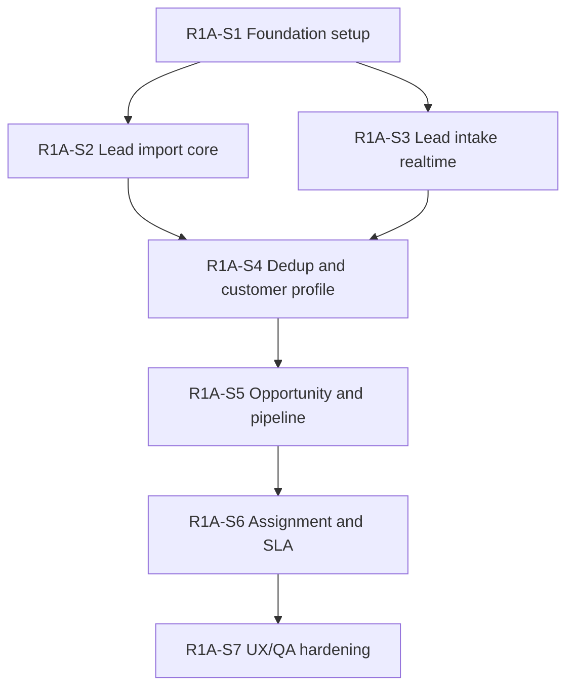

# R1A Development Backlog - Lead & Pipeline Core

> Phiên bản cập nhật: `v2.1 - Architecture version/convention lock - 2026-06-29`.
> Baseline kỹ thuật hiện hành: `Java + Spring Boot ecosystem`, `PostgreSQL`, `Flyway`, `Spring Data JPA/Hibernate`.
> Ghi chú: file này đã được đồng bộ theo quyết định chọn Spring Boot và MAR-ARCH-1.0; development commitment vẫn phụ thuộc sign-off `SP1-D01` đến `SP1-D10`.
## 1. Trạng thái tài liệu

| Thuộc tính | Giá trị |
|---|---|
| Tên tài liệu | R1A Development Backlog |
| Vai trò tài liệu | Backlog dev đề xuất sau grooming pack |
| Nguồn baseline | `03-r1-story-specs.md`, `04-r1a-technical-ba-spec.md`, `05-r1a-api-contract.md`, `06-r1a-db-schema-erd.md`, `07-r1a-wireframe-checklist.md`, `08-r1a-grooming-review.md` |
| Trạng thái | Draft backlog, not yet sprint-ready |
| Ngày lập | 2026-06-29 |

Backlog này chưa phải sprint commitment. Mục tiêu là chuyển R1A thành các work item có thứ tự, dependency, Definition of Ready và test focus để PO/Tech Lead có thể estimate và đưa vào sprint.

## 2. Backlog slicing strategy

R1A nên chia theo 7 nhóm triển khai:

| Slice | Tên | Mục tiêu |
|---|---|---|
| R1A-S1 | Foundation setup | Tenant, user, permission, catalog |
| R1A-S2 | Lead import core | CSV import preview/confirm/history |
| R1A-S3 | Lead intake realtime | Website webhook, Meta webhook, idempotency |
| R1A-S4 | Dedup and customer profile | Normalize, auto-link, possible duplicate, merge/unmerge |
| R1A-S5 | Opportunity and pipeline | Opportunity, stage transition, lost reason, stage history |
| R1A-S6 | Assignment and SLA | Rule, fallback, owner, SLA task, overdue |
| R1A-S7 | UX/QA hardening | Wireframe states, permission behavior, regression scenarios |

## 3. Priority model

| Priority | Meaning |
|---|---|
| P0 | Bắt buộc để R1A chạy end-to-end |
| P1 | Nên có trong R1A nếu effort hợp lý |
| P2 | Có thể defer sau R1A |

## 4. Epic-level dependency map



## 5. R1A-S1 Foundation setup

### R1A-BE-001 - Tenant schema and service

| Field | Value |
|---|---|
| Type | Backend |
| Priority | P0 |
| Source story | US-01.01 |
| Depends on | None |
| DoR status | Ready after project bootstrap verifies MAR-ARCH-1.0 |

Scope:

- Create tenant table/model.
- Create tenant create/update APIs.
- Enforce tenant inactive rule for later lead intake.

Acceptance:

- Admin can create tenant with timezone/currency.
- Missing tenant name is rejected.
- Tenant inactive can be set without deleting data.

Test focus:

- Tenant create/update.
- Default timezone `Asia/Ho_Chi_Minh`.
- Inactive status behavior.

### R1A-BE-002 - Branch, user and role model

| Field | Value |
|---|---|
| Type | Backend |
| Priority | P0 |
| Source story | US-01.02, US-01.03 |
| Depends on | R1A-BE-001 |
| DoR status | Ready after Team decision |

Scope:

- Branch model/API.
- User model/API.
- Role enum.
- User-branch relationship.

Acceptance:

- Admin can create branch.
- Admin can create user with role and branch.
- Inactive user cannot receive new assignment.

Open decision:

- Team entity required or branch scope enough.

### R1A-BE-003 - Permission matrix enforcement

| Field | Value |
|---|---|
| Type | Backend |
| Priority | P0 |
| Source story | US-01.04 |
| Depends on | R1A-BE-002 |
| DoR status | Ready after permission matrix confirm |

Scope:

- PermissionProfile model.
- Permission matrix API.
- API authorization middleware/service.
- Audit permission change.

Acceptance:

- Advisor cannot import/export/merge.
- Marketing cannot write payment.
- Admin permission update creates AuditLog.

### R1A-FE-001 - Tenant/branch/user/permission screens

| Field | Value |
|---|---|
| Type | Frontend |
| Priority | P0 |
| Source screen | WF-01, WF-02, WF-03, WF-04 |
| Depends on | R1A-BE-001, R1A-BE-002, R1A-BE-003 |
| DoR status | Needs wireframe confirmation |

Scope:

- Tenant setup form.
- Branch management.
- User management.
- Permission matrix UI.

Acceptance:

- UI hides/blocks actions by permission.
- Inline validation shown.
- Permission change requires reason if configured.

### R1A-BE-004 - Language/program/course catalog

| Field | Value |
|---|---|
| Type | Backend |
| Priority | P0 |
| Source story | US-02.01, US-02.02, US-02.03 |
| Depends on | R1A-BE-001 |
| DoR status | Ready |

Scope:

- Language/program/course tables.
- CRUD APIs.
- Active/inactive rules.

Acceptance:

- Admin can create English/Japanese/Chinese/custom.
- Program must belong to active language.
- Course tuition cannot be negative.

### R1A-FE-002 - Catalog management screen

| Field | Value |
|---|---|
| Type | Frontend |
| Priority | P0 |
| Source screen | WF-05 |
| Depends on | R1A-BE-004 |
| DoR status | Needs UX confirmation |

Scope:

- Language list/form.
- Program list/form.
- Course list/form.

Acceptance:

- Inactive items cannot be selected for new lead/opportunity.
- UI does not hard-code IELTS/JLPT/HSK logic.

## 6. R1A-S2 Lead import core

### R1A-BE-005 - Import batch and import row model

| Field | Value |
|---|---|
| Type | Backend |
| Priority | P0 |
| Source story | US-03.01, US-03.07 |
| Depends on | R1A-BE-001, R1A-BE-003 |
| DoR status | Ready after DB schema review |

Scope:

- ImportBatch table.
- ImportRows table.
- Mapping config storage.
- Import history API.

Acceptance:

- Preview creates batch but not official leads.
- Batch stores mapping_config and row summary.
- Import history shows total/created/error/duplicate.

### R1A-BE-006 - Lead import preview API

| Field | Value |
|---|---|
| Type | Backend |
| Priority | P0 |
| Source story | US-03.01, US-03.05, US-03.06 |
| Depends on | R1A-BE-005, R1A-BE-004 |
| DoR status | Ready after sync/async decision |

Scope:

- Upload CSV.
- Column mapping.
- Normalize phone/email.
- Validate rows.
- Detect duplicate candidates.
- Return preview summary.

Acceptance:

- Row missing phone/email/Zalo ID goes to error preview.
- Mapping missing contact field blocks confirm.
- Duplicate candidates include match type.

### R1A-BE-007 - Lead import confirm API

| Field | Value |
|---|---|
| Type | Backend |
| Priority | P0 |
| Source story | US-03.01, US-03.07 |
| Depends on | R1A-BE-006, R1A-BE-009, R1A-BE-012, R1A-BE-012A |
| DoR status | Blocked until dedup and opportunity model ready |

Scope:

- Confirm previewed batch.
- Idempotency key.
- Create/link lead/customer/opportunity.
- Create duplicate cases.
- Trigger assignment/SLA if possible.

Acceptance:

- Confirm same batch twice does not create duplicates.
- Confirm writes AuditLog.
- Summary count accurate.

### R1A-FE-003 - Lead import wizard

| Field | Value |
|---|---|
| Type | Frontend |
| Priority | P0 |
| Source screen | WF-06 |
| Depends on | R1A-BE-006, R1A-BE-007 |
| DoR status | Needs UX confirmation |

Scope:

- Source select.
- Upload/mapping.
- Preview errors.
- Preview duplicates.
- Confirm result.

Acceptance:

- Cannot confirm before preview.
- Error rows show row number and reason.
- Double confirm is prevented or harmless.

### R1A-FE-004 - Import history screen

| Field | Value |
|---|---|
| Type | Frontend |
| Priority | P1 |
| Source screen | WF-07 |
| Depends on | R1A-BE-005 |
| DoR status | Ready |

Scope:

- Import history list.
- Batch detail.
- Error report view.

Acceptance:

- User sees status and counts.
- User can inspect failed rows.

## 7. R1A-S3 Lead intake realtime

### R1A-BE-008 - Webhook idempotency and raw payload handling

| Field | Value |
|---|---|
| Type | Backend |
| Priority | P0 |
| Source story | US-03.02, US-03.03 |
| Depends on | R1A-BE-001 |
| DoR status | Blocked until raw payload/idempotency decision |

Scope:

- Integration key/signature baseline.
- Idempotency store.
- Sanitized raw payload or payload hash.

Acceptance:

- Same external_id does not create duplicate lead.
- Invalid tenant key rejected.
- Payload hash stored for duplicate prevention.

### R1A-BE-008A - IntegrationEvent / WebhookEvent log

| Field | Value |
|---|---|
| Type | Backend |
| Priority | P0 |
| Source story | US-03.02, US-03.03 |
| Depends on | R1A-BE-008 |
| DoR status | Ready after integration retention decision |

Scope:

- `integration_events`/WebhookEvent model and service.
- Status lifecycle: `RECEIVED`, `PROCESSED`, `FAILED`, `DUPLICATE`.
- Store `payload_hash`, external id/idempotency key, error_code/error_message.
- Store raw/sanitized payload URI if enabled by policy.
- Link created lead/customer/opportunity when processing succeeds.

Acceptance:

- Every webhook request creates or updates one event log.
- Duplicate webhook is visible as `DUPLICATE` and does not create duplicate lead.
- Failed webhook has error_code/error_message for Admin/Marketing debug.
- Raw payload access follows masking/retention policy.

### R1A-BE-009 - Website form lead webhook

| Field | Value |
|---|---|
| Type | Backend |
| Priority | P0 |
| Source story | US-03.02 |
| Depends on | R1A-BE-008, R1A-BE-008A, R1A-BE-012A, R1A-BE-016 |
| DoR status | Ready after webhook response decision |

Scope:

- Accept website form payload.
- Validate/normalize.
- Create lead/customer/opportunity.
- Run assignment/SLA.

Acceptance:

- Valid payload creates lead in correct tenant.
- Missing contact identifier rejected.
- Duplicate external_id does not create duplicate.

### R1A-BE-010 - Meta Lead Ads webhook baseline

| Field | Value |
|---|---|
| Type | Backend |
| Priority | P1 |
| Source story | US-03.03 |
| Depends on | R1A-BE-008, R1A-BE-008A, R1A-BE-009 |
| DoR status | Needs Meta integration detail |

Scope:

- Accept normalized Meta payload.
- Store source=Meta.
- Store campaign/adset/ad.
- Process like website lead.

Acceptance:

- Meta lead has source/campaign/adset/ad if supplied.
- Meta lead can be marked hot by config.

## 8. R1A-S4 Dedup and customer profile

### R1A-BE-011 - Lead/customer normalization service

| Field | Value |
|---|---|
| Type | Backend |
| Priority | P0 |
| Source story | US-03.04 |
| Depends on | R1A-BE-004 |
| DoR status | Ready |

Scope:

- Normalize phone.
- Normalize email.
- Calculate contactability.
- Create lead valid/invalid status.

Acceptance:

- Phone exact normalized used for dedup.
- Email lowercase/trim.
- Lead missing all contact identifiers invalid.

### R1A-BE-012 - Customer profile and auto-link rules

| Field | Value |
|---|---|
| Type | Backend |
| Priority | P0 |
| Source story | US-03.04, US-03.09 |
| Depends on | R1A-BE-011 |
| DoR status | Ready after duplicate decision confirm |

Scope:

- CustomerProfile model/service.
- Phone exact auto-link.
- Zalo exact verified auto-link.
- Create customer if no match.

Acceptance:

- Phone exact links to existing customer.
- Only name match does not merge.
- Customer is tenant-isolated.

### R1A-BE-012A - CustomerIdentity model and identity service

| Field | Value |
|---|---|
| Type | Backend |
| Priority | P0 |
| Source story | US-03.04, US-03.10 |
| Depends on | R1A-BE-011, R1A-BE-012 |
| DoR status | Ready after DB schema confirms customer_identities |

Scope:

- CustomerIdentity model/service for PHONE, EMAIL and ZALO_ID P0-lite.
- Store raw_value and normalized_value.
- Link multiple identities to one CustomerProfile.
- Mark primary identity per identity type.
- Use identity lookup in dedup and auto-link.

Acceptance:

- One customer can have multiple phone/email/Zalo identities.
- Phone exact match searches CustomerIdentity, not only CustomerProfile primary_phone.
- Identity from another tenant never matches.
- CustomerProfile primary phone/email are shortcuts, not the only source of truth.

### R1A-BE-013 - Duplicate case service

| Field | Value |
|---|---|
| Type | Backend |
| Priority | P0 |
| Source story | US-03.04, US-03.08 |
| Depends on | R1A-BE-012, R1A-BE-012A |
| DoR status | Ready |

Scope:

- DuplicateCase model.
- Email exact phone different -> `NEEDS_REVIEW`.
- Near match -> `NEEDS_REVIEW`.
- Resolve actions: merge/link/ignore.

Acceptance:

- Possible duplicate not auto-merged.
- Merge requires reason.
- Advisor cannot merge.

### R1A-BE-014 - Merge history and unmerge

| Field | Value |
|---|---|
| Type | Backend |
| Priority | P1 |
| Source story | US-03.08 |
| Depends on | R1A-BE-013 |
| DoR status | Needs unmerge permission confirm |

Scope:

- MergeHistory.
- Admin unmerge if can_unmerge.
- Audit merge/unmerge.

Acceptance:

- Admin can unmerge allowed merge.
- Unmerge not allowed returns clear error.

### R1A-FE-005 - Duplicate review screen

| Field | Value |
|---|---|
| Type | Frontend |
| Priority | P0 |
| Source screen | WF-08 |
| Depends on | R1A-BE-013 |
| DoR status | Ready after UX confirms no bulk ignore |

Scope:

- Duplicate list.
- Compare lead/customer.
- Merge/link/ignore action.
- Reason modal.

Acceptance:

- Advisor has no merge UI.
- Merge action warns and requires reason.

## 9. R1A-S5 Opportunity and pipeline

### R1A-BE-015 - Admission opportunity service

| Field | Value |
|---|---|
| Type | Backend |
| Priority | P0 |
| Source story | US-03.09, US-04.01 |
| Depends on | R1A-BE-012, R1A-BE-012A, R1A-BE-004 |
| DoR status | Ready |

Scope:

- AdmissionOpportunity model.
- Create opportunity from lead/customer.
- Program-different creates new opportunity.
- Touchpoint links.

Acceptance:

- Customer with new program gets new opportunity.
- Same active program does not create duplicate opportunity unless rule says so.

### R1A-BE-016 - Pipeline transition service

| Field | Value |
|---|---|
| Type | Backend |
| Priority | P0 |
| Source story | US-04.02, US-04.05, US-04.06 |
| Depends on | R1A-BE-015 |
| DoR status | Ready after SLA/stage decision |

Scope:

- Allowed transition matrix.
- Stage update API.
- Lost reason validation.
- StageHistory append.

Acceptance:

- New -> Enrolled blocked.
- Lost requires lost_reason.
- StageHistory created every transition.

### R1A-BE-017 - Stage history and timeline API

| Field | Value |
|---|---|
| Type | Backend |
| Priority | P0 |
| Source story | US-04.07 |
| Depends on | R1A-BE-016 |
| DoR status | Ready |

Scope:

- Stage history query.
- Duration in previous stage.

Acceptance:

- Timeline returns from_stage/to_stage/changed_by/changed_at/duration.
- Stage history append-only.

### R1A-BE-017A - Activity / InteractionLog service

| Field | Value |
|---|---|
| Type | Backend |
| Priority | P0 |
| Source story | US-04.02, US-04.08, US-05.03 |
| Depends on | R1A-BE-015 |
| DoR status | Ready after ActivityLog schema confirmed |

Scope:

- Activity/InteractionLog model and API.
- Support activity_type: CALL, ZALO, SMS, EMAIL, NOTE, MEETING.
- Support activity_result: ATTEMPTED, CONNECTED, REPLIED, NO_ANSWER, FAILED, SENT.
- Store occurred_at, actor, note and source.
- Expose create/list APIs for opportunity activities.

Acceptance:

- Advisor can record call attempt/no answer/connected/replied/note.
- First valid outbound activity can complete first response SLA.
- Contact success is counted only for connected/replied activity result.
- Stage `CONTACTING` alone does not count as SLA hit.

### R1A-FE-006 - Advisor inbox and opportunity list

| Field | Value |
|---|---|
| Type | Frontend |
| Priority | P0 |
| Source screen | WF-09 |
| Depends on | R1A-BE-015, R1A-BE-017A, R1A-BE-019 |
| DoR status | Needs final inbox table/list decision |

Scope:

- Advisor inbox.
- Filters by stage/SLA/source/program.
- Quick actions.

Acceptance:

- Advisor sees only own.
- SLA status visible.
- Quick actions follow transition matrix.

### R1A-FE-007 - Opportunity detail and stage change

| Field | Value |
|---|---|
| Type | Frontend |
| Priority | P0 |
| Source screen | WF-10, WF-11 |
| Depends on | R1A-BE-016, R1A-BE-017, R1A-BE-017A |
| DoR status | Ready after UX confirms stage display |

Scope:

- Customer/lead/opportunity summary.
- Stage selector.
- Lost reason modal.
- Stage history timeline.

Acceptance:

- Only allowed next transitions shown.
- Lost reason required.
- Stage history refreshes after update.

### R1A-FE-007A - Activity timeline and add activity UI

| Field | Value |
|---|---|
| Type | Frontend |
| Priority | P0 |
| Source screen | WF-15 |
| Depends on | R1A-BE-017A |
| DoR status | Ready after WF-15 wireframe accepted |

Scope:

- Activity timeline in Opportunity Detail.
- Add call/Zalo/SMS/email/note activity.
- Activity result selector.
- Contact success visual state.
- Permission-limited contact/raw note masking if configured.

Acceptance:

- Advisor can add outbound attempt from Opportunity Detail.
- Timeline shows occurred_at, type, result, actor and note.
- Connected/replied is visually distinct from no_answer/attempted.
- UI does not mark SLA hit by stage change alone.

## 10. R1A-S6 Assignment and SLA

### R1A-BE-018 - Assignment rule engine

| Field | Value |
|---|---|
| Type | Backend |
| Priority | P0 |
| Source story | US-05.01, US-05.04 |
| Depends on | R1A-BE-002, R1A-BE-015 |
| DoR status | Ready after Team decision |

Scope:

- AssignmentRule model.
- Rule priority.
- Advisor pool.
- Least workload/round-robin.
- Unassigned queue trigger.

Acceptance:

- Lead matches language/program/branch rule.
- No rule match uses fallback.
- No active advisor creates unassigned item/alert.

### R1A-BE-019A - WorkingHours and SLA policy baseline

| Field | Value |
|---|---|
| Type | Backend |
| Priority | P0 |
| Source story | US-05.02, US-05.05 |
| Depends on | R1A-BE-001 |
| DoR status | Ready after working hours default confirmed |

Scope:

- `working_hours_configs` baseline.
- `sla_policies` baseline for HOT/NORMAL/AFTER_HOURS.
- Tenant timezone.
- Default pilot: Monday-Saturday, 08:00-18:00.
- After-hours next working shift calculation.

Acceptance:

- Hot/normal due_at uses SLA policy.
- After-hours lead due_at moves to next working shift.
- Missing config uses default pilot and emits config warning.
- Branch override can be added without changing SLA task contract.

### R1A-BE-019 - SLA task service

| Field | Value |
|---|---|
| Type | Backend |
| Priority | P0 |
| Source story | US-05.02, US-05.03 |
| Depends on | R1A-BE-018, R1A-BE-017A, R1A-BE-019A |
| DoR status | Ready after SLA hit, ActivityLog and WorkingHours decisions |

Scope:

- Create first contact task after assignment.
- Calculate due_at by hot/normal/after-hours.
- Complete first response task from valid outbound activity.
- Overdue alert levels.
- Complete task.

Acceptance:

- Hot lead due 5-15 minutes.
- Normal due 30-60 minutes.
- First valid outbound activity in SLA marks first response SLA hit.
- Contact success is measured separately from connected/replied activity.
- Overdue first alerts Advisor, then Sales Lead.
- Owner not auto-changed in R1A.

### R1A-FE-008 - Assignment rule setup

| Field | Value |
|---|---|
| Type | Frontend |
| Priority | P0 |
| Source screen | WF-12 |
| Depends on | R1A-BE-018 |
| DoR status | Needs UX confirmation |

Scope:

- Rule list.
- Rule form.
- Advisor pool.
- Test assignment panel.

Acceptance:

- Inactive advisors not selectable or flagged.
- Rule test shows selected owner and reason.

### R1A-FE-009 - SLA and unassigned views

| Field | Value |
|---|---|
| Type | Frontend |
| Priority | P0 |
| Source screen | WF-13, WF-14 |
| Depends on | R1A-BE-019, R1A-BE-019A |
| DoR status | Ready after alert behavior confirm |

Scope:

- Advisor SLA tasks.
- Sales Lead overdue view.
- Unassigned queue.
- Manual assign action.

Acceptance:

- Overdue visible.
- Manual assignment requires reason.
- No auto owner change on overdue.

## 11. R1A-S7 QA, audit, observability

### R1A-BE-020 - Audit log baseline

| Field | Value |
|---|---|
| Type | Backend |
| Priority | P0 |
| Source story | US-01.04, US-03.07, US-03.08, US-04.02, US-05.01 |
| Depends on | R1A-BE-003 |
| DoR status | Ready |

Scope:

- AuditLog table/service.
- Log permission change, import confirm, merge/unmerge, reassign, critical stage changes.

Acceptance:

- Audit includes actor, action, entity, before/after, reason if any.
- Normal users cannot edit audit.

### R1A-QA-001 - Import and dedup regression pack

| Field | Value |
|---|---|
| Type | QA |
| Priority | P0 |
| Depends on | R1A-BE-006, R1A-BE-013, R1A-FE-003 |
| DoR status | Ready |

Scope:

- Import valid file.
- Missing contact.
- Phone exact auto-link.
- Email exact phone different.
- Duplicate review actions.

### R1A-QA-002 - Pipeline and SLA regression pack

| Field | Value |
|---|---|
| Type | QA |
| Priority | P0 |
| Depends on | R1A-BE-016, R1A-BE-019, R1A-FE-007, R1A-FE-009 |
| DoR status | Ready |

Scope:

- Allowed transition.
- Invalid transition.
- Lost reason.
- SLA due/hit/miss.
- Overdue escalation.

## 12. Sprint candidate recommendation

### Sprint 1 candidate

| Item | Why |
|---|---|
| R1A-BE-001 | Tenant foundation |
| R1A-BE-002 | User/branch foundation |
| R1A-BE-003 | Permission enforcement |
| R1A-BE-004 | Catalog foundation |
| R1A-BE-005 | Import batch foundation |
| R1A-FE-001 | Admin setup UI shell |
| R1A-FE-002 | Catalog UI |

### Sprint 2 candidate

| Item | Why |
|---|---|
| R1A-BE-006 | Import preview |
| R1A-BE-011 | Normalization |
| R1A-BE-012 | Customer auto-link |
| R1A-BE-012A | CustomerIdentity model/service |
| R1A-BE-013 | Duplicate case |
| R1A-FE-003 | Import wizard |
| R1A-FE-005 | Duplicate review |

### Sprint 3 candidate

| Item | Why |
|---|---|
| R1A-BE-007 | Import confirm end-to-end |
| R1A-BE-008 | Webhook idempotency |
| R1A-BE-008A | IntegrationEvent/WebhookEvent log |
| R1A-BE-009 | Website webhook |
| R1A-BE-015 | Opportunity service |
| R1A-BE-016 | Pipeline transition |
| R1A-BE-017A | Activity/InteractionLog service |
| R1A-FE-006 | Advisor inbox |
| R1A-FE-007 | Opportunity detail |
| R1A-FE-007A | Activity timeline UI |

### Sprint 4 candidate

| Item | Why |
|---|---|
| R1A-BE-018 | Assignment engine |
| R1A-BE-019A | WorkingHours/SLA policy baseline |
| R1A-BE-019 | SLA task |
| R1A-BE-020 | Audit baseline hardening |
| R1A-FE-008 | Assignment setup |
| R1A-FE-009 | SLA/unassigned views |
| R1A-QA-001 | Regression import/dedup |
| R1A-QA-002 | Regression pipeline/SLA |

## 13. Definition of Ready by work item

Một item được chuyển sang sprint khi có đủ:

- Scope rõ và không overlap item khác.
- API contract hoặc UI contract tương ứng.
- DB impact rõ.
- Permission rule rõ.
- Validation rule rõ.
- Acceptance criteria testable.
- Test data hoặc QA scenario.
- Không phụ thuộc open decision chưa chốt.

## 14. Items currently blocked by decisions

| Item | Blocker |
|---|---|
| R1A-BE-002 | Team entity decision |
| R1A-BE-006 | Sync/async import preview decision |
| R1A-BE-007 | Dedup/opportunity flow final |
| R1A-BE-008 | Raw payload/idempotency decision |
| R1A-BE-008A | IntegrationEvent retention/raw payload access decision |
| R1A-BE-010 | Meta integration detail |
| R1A-BE-012A | CustomerIdentity P0-lite field/index decision |
| R1A-BE-014 | Unmerge permission decision |
| R1A-BE-017A | Activity type/result catalog and SLA completion rule |
| R1A-BE-018 | Team/branch assignment decision |
| R1A-BE-019A | Working hours default and SLA policy decision |
| R1A-BE-019 | SLA hit definition, ActivityLog and WorkingHours dependency |
| R1A-FE-006 | Advisor inbox table/list final |
| R1A-FE-007 | Stage display policy for R1B/R1C stages |
| R1A-FE-007A | WF-15 activity timeline UI accepted |

## 15. Minimum viable R1A demo path

Demo path nên dùng để nghiệm thu nội bộ:

```text
Admin tạo tenant
-> Tạo branch/user/advisor
-> Cấu hình English/IELTS/course
-> Import CSV lead
-> Preview lỗi và duplicate
-> Confirm import
-> Lead được normalize
-> CustomerProfile được tạo/link
-> AdmissionOpportunity được tạo
-> Assignment rule giao owner
-> SLA task được tạo
-> Advisor mở inbox
-> Advisor ghi outbound activity đầu tiên trong SLA
-> SLA task được hoàn thành bằng activity hợp lệ
-> Nếu khách phản hồi/nghe máy, Advisor ghi activity CONNECTED/REPLIED và chuyển Contacted
-> Sales Lead xem stage history, activity timeline, SLA status và contact success
```

Pass demo khi:

- Không tạo lead valid nếu thiếu contact identifier.
- Phone exact auto-link đúng.
- Email exact phone khác vào duplicate review.
- Opportunity có owner hoặc vào unassigned queue.
- Stage transition sai bị chặn.
- Lost reason bắt buộc.
- SLA task có due_at đúng timezone tenant.
- First response SLA hit dựa trên outbound activity trong SLA.
- Contact success dựa trên activity CONNECTED/REPLIED, không chỉ dựa vào stage.
